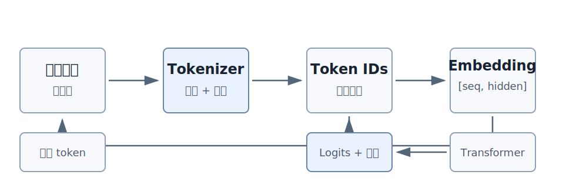
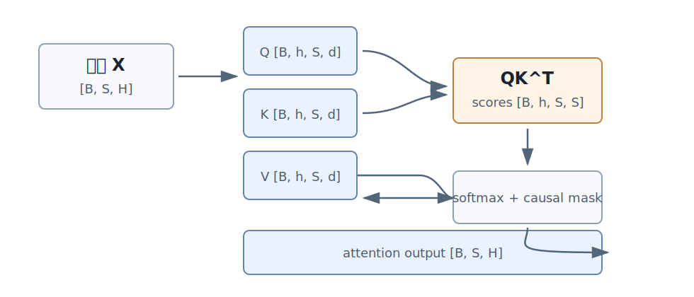
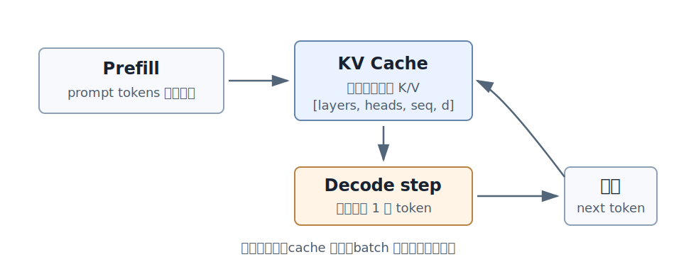

# 序章：为什么要从零理解语言模型

我第一次认真用语言模型的时候，记得有一种奇怪的双重感觉。它明明只是一段在数据中心里跑着的软件，却好像真的在和我说话——你问一个问题，它接得住你的意思；你说"改得更口语一点"，它知道你要什么；你让它写代码，它写出来的东西能跑。

然后过了五分钟，它编了一个不存在的论文引用，把一道简单加法算错，对一个错误前提自信解释了三段，最后在我明确要求"只输出 JSON"的时候，前面加了一句"好的，这是您要的 JSON"。

像懂，又不像真的懂；像工具，又像一个会犯奇怪错误的同事。

这本书从这个矛盾开始写。

如果你只把语言模型当成一个 API，很多现象都像黑箱。为什么同一句 prompt 每次回答不一样？为什么 temperature 调高一点回答就有创意但也更容易胡说？为什么它能写诗，却数不清一个单词里有几个字母？为什么长上下文这么贵？为什么训练一个前沿模型要烧成千上万张 GPU？为什么模型已经预训练过，还要做 SFT、RLHF、RLVR？

这些问题看起来分散，其实都连在同一条链上：文本怎么变成 token，token 怎么变成张量，张量怎么过 Transformer，模型怎么通过预测下一个 token 学到东西，训练怎么吃显存和算力，数据怎么塑造能力，推理怎么逐步生成，评估怎么判断好坏，对齐怎么改变行为。

"从零理解"是我有点犹豫的措辞。这本书肯定不会教你从零训练一个 GPT-4——那需要的数据、算力、工程团队和钱都不是个人能动的。我说的"从零"是另一个意思：不要只停在调接口，不要靠记几个模型名字混过去，而是把语言模型的关键抽象一层层拆开。拆到你能看见它的基本机制，知道它为什么有效，也知道它为什么会失败。

这件事值得做，因为语言模型的表面体验实在太容易骗人。API 把一个非常复杂的系统包装成一个简单的对话框：你输入字符串，它输出字符串。这层界面隐藏了几乎所有关键问题——tokenizer 的切分、模型内部的张量形状、训练时的显存账本、数据清洗、推理调度、评估和对齐的艰难取舍。

抽象当然有价值，没有它我们没法每天高效用复杂系统。但抽象也会漏水。当模型回答不稳定时，当成本突然飙升时，当评估分数很好但用户体验糟糕时，当模型学会钻奖励函数的空子时，你必须知道抽象下面发生了什么。否则你永远在猜。

写法上我借用了一句被引用过太多次的话：To understand it, you have to build it. 不过对爱好者来说，"亲手构建"很快就会变成另一种压力。很多教程上来就要求你实现 BPE、写 attention、估 FLOPs、跑训练循环。这样很严谨，但读者如果还不知道这些东西为什么重要，就会觉得自己在搬砖。

所以我的顺序是反过来的：先让你看见问题，再解释机制，最后讲工程后果。讲 tokenizer 时不从 BPE 定义开始，而从一个观察开始——为什么同一句中文被切出来的 token 数比你想象的多。讲 attention 时不先写 QK^T，而先问一个词为什么需要看上下文。讲 GPU 时不先列硬件术语，而先问为什么同样的计算量有的代码快有的慢。

读完这本书，你大概不会去训练前沿大模型。但你应该能做到几件事：看懂语言模型从文本到生成的基本流程；解释训练和推理成本为什么这么高；判断一个模型问题更可能出在数据、模型、推理、评估还是对齐；读论文、工程文档和开源实现时不被术语淹没；设计一个小而可信的语言模型实验。

这已经够用。大模型时代真正稀缺的不是会调工具的人，是能看穿工具表面、理解系统约束、做出清醒判断的人。

---

后面会反复出现一个虚构的小系统——一个研究资料助手。用户上传论文、课程笔记、技术报告，提问，助手要从资料里找证据、给回答、标依据，资料不足时承认不知道，要够快，成本要可控。

我不是要教你怎么做这个产品，是因为它会牵出本书的每一个问题。资料怎么切成 token，长文档怎么进上下文，模型怎么把问题和证据连起来，训练数据怎么影响回答风格，推理为什么会慢，评估怎么发现幻觉，SFT 怎么教模型承认不知道，偏好学习怎么比较两个回答，verifier 怎么提高可靠性。

不是每一章都会回到它，但需要一个具体场景时它就在那。这样比反复造新例子要省事，对你也省记忆负担。

全书大致分五段。第 1–4 章把文本送进模型内部——token、张量、attention、Transformer block。第 5–8 章把最小模型训练起来——样本、训练循环、资源账本、GPU。第 9–13 章让系统跑得动——高性能算子、并行、MoE、scaling、推理。第 14–20 章让回答可信——评估、数据、SFT、偏好学习、RLHF、RLVR。第 21–24 章把这些东西收束成你自己的小项目和判断力。

不用按顺序看，也不用一次看懂所有细节。第一遍读抓直觉，第二遍读细节。等你真去训练小模型、写 tokenizer、做评估，那些原本抽象的概念会突然变得很具体：sequence length 不再是一个数字，是显存和速度；validation loss 不再是图表上的一条线，是实验值不值得相信的信号；reward hacking 不再是论文里的词，是模型真的钻了你奖励函数的空子，理直气壮。

# 第 1 章：文字如何变成 token

随便挑一句话：

```text
我今天在 GitHub 上看到一个 repo，感觉很有意思。
```

你读这句话不会想"GitHub"有几个片段、"repo"是不是英文单词、逗号算不算一个单位。意思一次就到了。模型不能这样读。模型在看到文字之前，必须先过一道门，叫 tokenizer。

Tokenizer 做的事很朴素：把字符串切成一串 token，再把 token 映射成整数。神经网络真正处理的从来不是"我"或"GitHub"这些字符，是一串整数 id，以及由这些 id 查表得到的向量。

这听起来像预处理。其实不是小事。它决定模型能看见什么、每段文本占多少上下文、最后能输出哪些片段，也决定训练和推理的钱包是怎么花的。



按人的直觉切，上面那句话大概是这样：

```text
我 / 今天 / 在 / GitHub / 上 / 看到 / 一个 / repo / ， / 感觉 / 很 / 有意思 /。
```

但现代语言模型通常不按自然语言的"词"切。一个真实的 tokenizer 可能把它切成：

```text
我 / 今天 / 在 / GitHub / 上 / 看到 / 一个 / repo / ， / 感觉 / 很 / 有 / 意思 /。
```

也可能某些部分切得更碎。不同模型不一样，没有正确答案。这就是关于 tokenizer 第一个值得记住的事：token 不等于词。一个 token 可能是一个汉字、一个英文单词、一个英文子词、一个前导空格加单词、一个标点，也可能只是某个 byte 片段。

切完以后，模型看到的是一串整数：

```text
[37046, 245, 19000, 102, 361, 1847, 7386, ...]
```

这些数字本身没有大小意义。第 37046 号 token 不比第 245 号 token "更大"。它们就是词表里的编号。模型用这些编号去 embedding matrix 里查行，得到向量，然后才进入 Transformer。

**切多小才合适**

最容易把 tokenizer 误解成"把文字切小"。真正的问题不是切小，是切多小才合适。两头都不好——切得太小，序列变长，attention、KV cache、API 计费全部变贵；切得太大，词表会爆炸，罕见字符串还处理不好。

最简单的方案是按字符切。英文按字母，中文按汉字，标点单独算。

```text
hello -> h / e / l / l / o
语言模型 -> 语 / 言 / 模 / 型
```

好处是几乎没有未知字符。坏处是太碎。`hello` 按字符切要 5 个 token，常见 BPE tokenizer 可能只用 1 个。序列长了，后面所有的成本都跟着涨：attention 要处理更多位置，KV cache 要存更多历史，推理也常常按 token 收钱。

而且按字符切完全不利用常见片段。英文里的 `tion`、代码里的 `return`、URL 里的 `https://` 都是反复出现的模式。每次都拆到字符再让模型自己学着组回去，是浪费。

那按词切呢？英文用空格切，中文用分词器，代码用符号切。听起来直观，但会撞上词表爆炸。自然语言里有无数名字、拼写变体、数字、版本号、URL、代码标识符——你不可能预先把它们全放进词表。传统 NLP 用 `<UNK>` 表示未知，这对生成模型是灾难。函数名、订单号、论文编号一旦被压成 `<UNK>`，模型就再也复制不出来了。

所以现代 tokenizer 必须折中：常见片段要短，罕见片段也必须能表示。BPE 就是从这个折中里长出来的。

**BPE 直觉**

BPE 全称 Byte Pair Encoding，思路一句话就说完了：先把文本切得很碎，然后反复合并最常一起出现的相邻片段。

假设语料里反复出现：

```text
low lower lowest
```

最开始这可以看成：

```text
l o w
l o w e r
l o w e s t
```

`l` 和 `o` 经常相邻，合并成 `lo`。`lo` 和 `w` 经常相邻，合并成 `low`。继续下去，`er`、`est` 也变成片段。

最后得到的不是一本词典，是一组合并规则。遇到没见过的 `lowering`，tokenizer 仍然能用已有片段拼出来：`low / er / ing`。常见词可以很短，罕见词也不会直接退化成未知。

**token 数是钱，不是排版**

同一段文本，不同 tokenizer 的 token 数可以差很多：

```text
同一段资料
Tokenizer A: 1000 tokens
Tokenizer B: 1400 tokens
```

如果上下文窗口固定，A 能放下更多。对 Transformer，序列越长，attention 和 KV cache 越贵。对 API 用户，输入输出常按 token 收钱。

这件事在多语言里特别明显。如果某种语言被切得更碎，同样的意思就要更多 token——用户感觉上下文不够用，开销更高，模型在固定训练预算下也要花更多 token 才能"读完"同样的信息。我见过的不少多语言模型的"歧视"，其实就是 tokenizer 的歧视。

代码也类似。缩进、括号、点号、下划线、长变量名、路径、哈希——tokenizer 对代码不友好的话，序列膨胀得很快，模型写也累、读也累。

所以你不要用"字数"估上下文。模型吃进去的是 token，不是字。

**绑定关系：tokenizer、词表、embedding、logits**

很多人把 tokenizer 当成模型外面的一个工具。更准确的说法是：tokenizer、词表、embedding matrix 和输出层是一套绑死的东西。

设词表大小 50000。输入时每个 token id 去 embedding matrix 里查一行：

```text
[50000, hidden]
```

输出时模型要给词表里每个 token 一个分数，logits 的最后一维就是 50000：

```text
[batch, seq, 50000]
```

也就是说，词表不只是决定"输入怎么切"，还决定了"模型每一步能预测什么"。

这一句话能解释几个常见的工程现象。模型和 tokenizer 不能换着混用，换了 tokenizer，id 的含义全错位。给模型加 token 不是改一个配置文件就完了，你要给新 token 加 embedding 行、加输出权重，还要训练它们，否则它就是个空壳。词表越大，输出层和 loss 计算越贵，tokenizer 的选择会一路影响训练内存和推理速度。

**可逆性**

好的 tokenizer 应该尽量做到：

```text
decode(encode(text)) == text
```

这叫可逆性。聊天里少一个空格无伤大雅；Python 缩进错了，程序直接坏；JSON 多一个逗号，parser 直接拒收。代码、JSON、路径、表格、数学表达式都对这件事很敏感。

byte-level tokenizer 受欢迎的一个原因就在这——只要文本能变成 byte，就不会丢掉罕见字符。代价是序列稍微长一点，但稳定性换来的麻烦少很多。

**tokenizer 出问题时的伪装**

我帮人排查过的很多"模型不行"的问题，最后查到根上是 tokenizer 的事，但表象完全不像。

模型抄错长编号——订单号、电话号、commit hash、论文编号常被切成多个 token，生成时中间错一个，整个编号就废。

结构化输出不稳——JSON、YAML、Markdown 表格、Python 缩进都依赖标点和空白，tokenizer 切分、训练数据、解码策略加在一起影响这件事。

专业术语写错——罕见医学名词、化学式、法律条款编号被切得太碎，模型要组合多个 token 才能写对一个词，错误概率自然高。

RAG 的 chunk 大小总不稳定——按字符切文档，chunk 的 token 长度会忽长忽短。更稳的是按 token 预算切，同时保留段落、标题、代码块、表格的边界。

遇到这些症状，第一件事就是把出错的字符串塞进 tokenizer，看它到底被切成了什么。比想象快。

**什么时候要自己训 tokenizer**

大多数应用不需要。用 API 或开源模型时，tokenizer 已经和权重绑死了，不能换。

只有从头训练，或者做非常特殊的领域模型时，才需要认真设计 tokenizer。中文古籍、基因序列、化学式、日志、代码、数学公式——通用 tokenizer 未必合适。要训的话至少检查这几类样本：常见自然语言切得合不合理；专业术语会不会过碎；数字、单位、版本号稳不稳；代码缩进和符号有没有保留；低资源语言会不会被极端切碎；特殊 token 设没设计清楚。

tokenizer 一旦定下，后面改动代价很大。它不是一个随手可换的前处理脚本，而是模型输入输出空间的一部分。

**nanoGPT 对照**

整本书我会反复回到 nanoGPT 的代码做对照，第一段是它的最小 tokenizer：

```python
stoi = { ch:i for i,ch in enumerate(chars) }
itos = { i:ch for i,ch in enumerate(chars) }
def encode(s):
    return [stoi[c] for c in s]
def decode(l):
    return ''.join([itos[i] for i in l])
```

来自 `data/shakespeare_char/prepare.py:29-35`。它把字符变成整数，再把整数变回字符。换成 BPE 时，`data/shakespeare/prepare.py:19-22` 用 `tiktoken.get_encoding("gpt2")` 做同类事情。两段代码加起来不到二十行，但它们已经说出了本章的全部意思：token 不是词，是模型和文本之间一套约定俗成的编码。

这一章里说的资料助手碰到的第一个问题就是这件事。一篇论文、一段代码文档、一张表格，被切成多少 token，直接决定上下文能放多少证据、检索片段怎么拼、推理要花多少钱。后面 attention、KV cache、推理调度的所有讨论，最后都会绕回这里。

下一章我们追这串整数：模型拿到一串 token id，训练时到底在干什么？

# 第 2 章：下一个 token 预测到底在学什么

上一章把一句话变成了 token。现在的问题是：模型拿到一串 token id 以后，训练时到底在做什么？

很多人会说，模型在学语言、学知识、学推理、学编程。从结果看没错，从训练目标看太宽。基础语言模型的核心训练任务，朴素到几乎令人失望：

```text
根据前面的 token，预测下一个 token。
```

就这一句话。我第一次读到的时候不太信——只预测下一个 token，怎么会学会翻译、写代码、解释论文、做数学题？这一章就是把这个看起来太简单的目标拆开。

**一句话变成多少训练样本**

随便挑一句：

```text
机器学习很好玩
```

假设 tokenizer 切成 4 个 token：

```text
机器 / 学习 / 很 / 好玩
```

训练时不会只从这句话拿一个样本。每个位置都是一个预测任务：

```text
看到：机器              预测：学习
看到：机器 学习         预测：很
看到：机器 学习 很      预测：好玩
```

如果 token id 是 `[12, 45, 83, 109]`，那训练时的输入和目标长这样：

```text
input_ids = [12, 45, 83]
labels    = [45, 83, 109]
```

`labels` 就是 `input_ids` 向右挪一位。训练代码里常见的 "shift" 就是这件事。

实际样本会更长。sequence length 取 2048 的话，一条样本就提供约 2048 个位置上的监督信号，模型在一次 forward 里把每个位置的下一个 token 都同时预测了。语言模型能从普通文本里榨出海量训练信号，靠的就是这种"每个位置都是一个题"的密度。

**输出的是分布，不是答案**

模型每一步不是吐出一个确定 token，而是给整个词表里的每个 token 打分。再用采样策略从分数里挑一个。所以同一句 prompt 每次结果不一样这件事，不是 bug，是设计本身。

假设上下文是：

```text
今天天气很
```

下一个 token 可能是"好"，可能是"冷"、"热"、"差"。词表大小 50000 的话，当前位置的 logits 就是 50000 个数：

```text
logits: [50000]
```

softmax 把这些分数变成概率。如果真实下一个 token 是"好"，cross entropy 会推模型提高"好"的概率，压低其他 token 的概率：

```text
真实 token 概率高  →  loss 小
真实 token 概率低  →  loss 大
```

注意 loss 惩罚的不是"模型不理解"，是"模型没有把真实下一个 token 放到足够高的概率上"。这两件事经常被混着说，但意思不同。

**为什么这么简单的目标会学出复杂能力**

关键是"下一个 token"很多时候并不是简单补词。看几个具体例子。

代码：

```python
def add(a, b):
    return a +
```

下一个 token 大概率和参数 `b` 有关。模型要预测对，得学函数参数、缩进、表达式结构。

数学：

```text
因为 17 + 25 =
```

要预测后面，模型可以记住常见加法，也可以在大量例子里学出更一般的计算结构。

问答：

```text
问：法国的首都是哪里？
答：
```

下一个 token 大概率是"巴黎"。要预测好，模型必须把问题形式、世界知识、回答格式连起来。

所以 next-token prediction 像一道很窄的门，但训练数据把所有任务都从这道门挤进去。为了持续降低 loss，模型被迫学语法、事实、格式、代码模式、推理步骤、对话结构。能力是从压力里逼出来的，不是从目标里设计出来的。

**它也解释了模型的局限**

同一个目标也划出了边界。模型被训练成"在上下文后面生成像训练数据的文本"，不是被直接训练成"永远诚实"、"知道自己不知道"、"只引用真实来源"。这件事很重要，因为它解释了大量真实现象。

模型能写流畅解释，是因为训练数据里大量都是流畅解释。它也能编造引用，因为训练数据里同样有大量"看起来像引用的文本"——基础训练目标不会自己去查引用是不是真的。

模型能生成代码，是因为训练数据里有代码。但它不一定知道代码能不能跑，除非训练或推理系统引入了测试、执行器、verifier 或人类反馈。

模型给出的答案听起来自信，是因为很多训练文本就是自信语气写的。"我不知道"在 next-token prediction 里没有奖励，除非数据和后训练明确教它在证据不足时停下。

预训练给模型广泛能力，对齐、工具、评估和系统设计决定这些能力能不能被靠谱地用起来。这件事会在第 17 章以后反复出现。

**训练和生成的根本差异**

训练时整段文本已经在数据里。模型可以一次处理整段，但 causal mask 让每个位置不能偷看未来——所有位置可以并行预测自己的下一个 token。

生成时不行。未来 token 还不存在，模型只能先根据 prompt 预测第一个 token，接回上下文，再预测第二个：

```text
prompt → token1
prompt + token1 → token2
prompt + token1 + token2 → token3
```

训练像批改一整篇已经写好的文章；生成像边想边写下一笔。这个区别第 13 章讲 prefill 和 decode 时会再出现一次——它是训练和推理整套成本结构不同的根源。

**loss 到底从哪里来**

把 batch 和词表加进来，训练时的核心张量是：

```text
input_ids: [batch, seq]
labels:    [batch, seq]
logits:    [batch, seq, vocab]
```

每个位置 `labels` 里有一个真实 token id，`logits` 里有整个词表的分数。Cross entropy 取出真实 token 对应的概率，惩罚它不够高。实际代码里常常把前两维展平：

```text
logits → [batch * seq, vocab]
labels → [batch * seq]
```

然后算所有位置的平均 loss。

但有一件事容易忽略：不是所有位置都参与 loss。padding token、用户输入部分、工具返回部分、某些分隔符，可能被 loss mask 忽略掉。预训练里大多数 token 都算；SFT 里常常只让 assistant 回复部分算。看不懂 loss mask 的话，你就不知道模型真正在学哪一段文本——这是 SFT 出问题时最容易忽略的方向之一。

**loss 低不等于助手好**

这件事我得专门讲一下。

一个模型在网页语料上 loss 很低，说明它擅长预测那一类网页文本。但网页文本里有什么？广告、论坛争吵、错误答案、过期资料、重复模板。预测这些文本本身和"是个好助手"几乎是两个目标。

好助手需要的能力很多——遵守指令、知道什么时候拒答、知道什么时候引用来源、按格式输出、能承认不确定、能用工具。这些大部分不是预训练 loss 能直接降下来的，而是后面 SFT、偏好学习、RLHF、RLVR、工具系统和评估一起带出来的。

所以看训练曲线时我建议固定问两件事：loss 是在什么数据分布上下降？这个分布和你要的行为有多接近？没有这两个问题，loss 很容易变成一个漂亮但不够用的数字。

**nanoGPT 对照**

这一章最该直接看的代码，是训练样本里 `x` 和 `y` 怎么错开一位：

```python
ix = torch.randint(len(data) - block_size, (batch_size,))
x = torch.stack([torch.from_numpy((data[i:i+block_size]).astype(np.int64)) for i in ix])
y = torch.stack([torch.from_numpy((data[i+1:i+1+block_size]).astype(np.int64)) for i in ix])
```

来自 `train.py:123-125`。`x` 是当前位置看到的 token，`y` 是每个位置要预测的下一个 token。`model.py:170-188` 把 logits 和 `targets` 送进 cross entropy，就是 next-token prediction 的训练目标——所有的复杂能力，最终都从这五六行代码里长出来。

资料助手的 base model 也是这样训出来的，它不是天生会回答问题。它先学的是在大量文本分布里预测下一个 token。这能解释为什么它写起论文风格的回答头头是道——也能解释为什么它会把没有依据的内容补得很自然。

下一章把 token id 送进模型内部，看它们怎么变成张量。

# 第 3 章：张量是模型世界里的物体

前两章里文字变成了 token，token 变成了 next-token prediction 的训练样本。现在我们进到模型内部，看这些 token id 到底变成了什么。

答案是张量。这句话听起来像数学课，但我不打算从线性代数定义开始。从一个更实际的问题开始：模型输入是这样一串数字：

```text
[17, 238, 91, 502]
```

神经网络能直接拿这些整数做计算吗？

不能。第 238 号 token 不比第 17 号"更强"，也不比它"更靠后"。这些数字只是编号，不是数值。模型第一步要做的是查表，把每个 token id 变成一个向量。

**从编号到向量**

这个表叫 embedding matrix。设词表大小 50000，hidden size 768，矩阵形状就是：

```text
[50000, 768]
```

每个 token id 对应一行。输入 4 个 token，取出 4 行：

```text
input_ids: [4]
embedding: [4, 768]
```

实际不会一次只处理一条样本。batch size 2、序列长度 4 的话：

```text
input_ids: [2, 4]
hidden:    [2, 4, 768]
```

这是语言模型里最重要的形状：

```text
[batch, seq, hidden]
```

`batch` 是一次处理多少条样本，`seq` 是每条样本多少 token，`hidden` 是每个 token 的向量长度。

如果你能在脑子里始终知道这三个维度的含义，后面读 Transformer、attention、KV cache、并行训练会轻松得多。我个人调试 Transformer 的习惯就是先在草稿上写一遍这条 shape 链，跟着代码走。出错的地方大概率在哪一维变错了。

**一次 forward 的 shape 旅行**

用玩具配置走一遍：

```text
batch = 2
seq = 4
vocab = 10000
hidden = 8
heads = 2
d_head = 4
```

输入 token id `[2, 4]`，embedding 后 `[2, 4, 8]`。

进 attention 前，模型从 hidden states 生成 Q、K、V，每个开始都是 `[2, 4, 8]`。拆成多头：

```text
[2, 2, 4, 4]
```

四个维度依次是 `[batch, heads, seq, d_head]`。Q 和 K 做匹配得到 attention score：

```text
[2, 2, 4, 4]
```

最后两个 4 含义是"每个位置看每个位置"。attention 输出再合回 heads，变回 `[2, 4, 8]`。MLP 进出仍是 `[2, 4, 8]`，只是中间会先扩到更宽的维度再缩回。最后输出层把 hidden 投到词表：

```text
logits: [2, 4, 10000]
```

labels 是 `[2, 4]`。算 loss 时把 logits 展平成 `[8, 10000]`，labels 展平成 `[8]`。这就是一条样本在一个小模型里的全部形状旅行。

**shape 是语义，不只是尺寸**

很多初学者看到 shape mismatch，本能地加一个 `reshape`。我自己也干过这种事。这很危险。shape 不是为了让代码跑起来，它表达语义。

考虑：

```text
[batch, seq, hidden]
```

和：

```text
[seq, batch, hidden]
```

元素数量可能一样，意义完全不同。把 batch 和 seq 搞反，程序可能还能跑，attention、mask、loss 全部都会错。最麻烦的是它不一定报错——你训练得好好的，下游评估出怪事。

再看 attention mask。一个 causal mask 可能是 `[1, 1, seq, seq]`，广播到 `[batch, heads, seq, seq]`。方便，也危险。mask 维度写错，模型可能偷看未来，也可能屏蔽掉合法 token。我们后面会反复看到这类例子。

所以张量调试的第一原则不是问"shape 能不能对上"，是问"每一维是什么意思"。

**dtype 和 device：张量不是抽象数组**

张量还有两个很现实的属性：dtype 和 device。

dtype 决定每个数用多少字节。fp32 是 4 bytes，fp16 和 bf16 是 2 bytes。参数量一样时，dtype 直接决定显存和带宽。大模型训练用 mixed precision 不是赶时髦，是显存和带宽真的太贵。

device 决定张量在 CPU 还是 GPU 上。GPU 算得快，但数据必须在 GPU 显存里。训练循环里如果每一步都临时把小张量从 CPU 搬到 GPU，程序能跑，GPU 在等。

性能问题经常不是模型结构问题，是数据加载、device 搬运、dtype 转换、非连续内存里某个不起眼的细节。我见过最离谱的一次，一个团队花两周优化 attention，最后发现 80% 的时间花在 dataloader 的字符串解析上。

**view、transpose、contiguous**

PyTorch 里的张量经常只是一块底层 storage 的视图。`view`、`transpose`、`permute` 大概率只改解释方式，不复制数据。`contiguous()` 则可能真分配新内存。

举例：`[batch, seq, hidden]` 经过 `transpose` 后，shape 看起来变了，但底层数据可能没动，只是 stride 变了。某些 kernel 能处理这种布局，某些操作会偷偷触发复制。

在小模型里这是细节。在大模型里一次意外复制可能就是几百 MB 甚至几 GB 的显存峰值。高性能 attention、KV cache、tensor parallel 都很在乎 layout。所以 `view`、`reshape`、`transpose`、`contiguous` 不是代码仪式，它们在管理逻辑形状和物理布局的关系。

**词表成本会在 logits 处现形**

很多人估模型成本时只看层数和 hidden size，忘了输出层。语言模型最后要给词表里每个 token 一个分数。

```text
batch = 8
seq = 2048
vocab = 100000
```

logits 元素数量是 `8 * 2048 * 100000 = 1,638,400,000`。十六亿多个数。fp16 也要 3GB 以上。实际系统用 fused cross entropy、vocab parallel、不保存完整 logits 等技巧来缓解，但这个形状本身告诉你一件事：词表大小会进入资源账本。

这一句话把第 1 章和这一章连起来。Tokenizer 决定词表，词表决定 embedding 和 logits，logits 又决定训练内存和计算成本。链条不长，但每一环都有钱在流。

**张量值也要看**

shape 对了不代表值对了。调模型时还要看数值范围。

值得养成的习惯是看这些数字：mean / std / min / max、NaN 数量、Inf 数量、gradient norm、mask 中 True/False 的比例、attention 有没有真的屏蔽掉未来位置。

有些错误只看 shape 是看不出来的。mask 没生效，模型偷看答案，loss 反而漂亮；某层输出 NaN，后面所有结果都被污染；softmax 前分数过大，概率早早集中到一个位置——这些都不会让代码挂掉。

一个我现在仍然在用的习惯：先用极小配置调试。

```text
batch = 1
seq = 4
hidden = 8
heads = 2
vocab = 20
```

小世界里能看清规则，再放大。这个建议看起来很初级，但每次我跳过这一步直接调大模型，几乎都会后悔。

**einsum 让计算意图显形**

很多张量计算可以用维度表达式直接读懂。attention score：

```text
b h q d, b h k d -> b h q k
```

意思是 batch 和 head 保留，query 位置和 key 位置形成关系，`d` 维被求和。

score 乘 V：

```text
b h q k, b h k d -> b h q d
```

比说"矩阵乘法"清楚得多。每个字母都有语义，你能看到 attention 是在 token 之间混合信息。MLP 写出来是：

```text
b s h, h m -> b s m
b s m, m h -> b s h
```

它保留 batch 和 sequence，只在 hidden 维上变换。这正好解释了第 4 章要讲的事——attention 跨 token 通信，MLP 在每个 token 内部加工。

**张量错误的三种形态**

第一种是直接报错。维度不匹配，矩阵乘不了。这是最幸运的，至少你立刻知道有错。

第二种是静默语义错误。shape 对得上，但 batch、seq、heads 的含义已经错位。模型能跑，结果不可信。这是最烦人的。

第三种是性能错误。结果正确，但 layout 不好、device 搬来搬去、隐式复制太多，速度和显存都很糟。

调试时别只打印 `.shape`。至少再看 dtype、device、是不是 contiguous、有没有 NaN、关键 mask 是不是你想要的样子。

**nanoGPT 对照**

张量不是抽象名词。nanoGPT 在 attention 里直接写出了形状变化：

```python
B, T, C = x.size()
q, k, v  = self.c_attn(x).split(self.n_embd, dim=2)
k = k.view(B, T, self.n_head, C // self.n_head).transpose(1, 2)
q = q.view(B, T, self.n_head, C // self.n_head).transpose(1, 2)
v = v.view(B, T, self.n_head, C // self.n_head).transpose(1, 2)
```

来自 `model.py:52-59`。`B` 是 batch，`T` 是序列长度，`C` 是 hidden size。多头 attention 不是魔法——只是把通道维拆成多个 head，让每个 head 单独做注意力。

资料助手在表面看处理的是字符串，模型内部处理的全是张量。能在脑子里跟着 shape 走，后面排查长上下文、batch、mask、logits 的问题时你才不会停在"模型不知道为什么不行"。

下一章把这些张量送进 Transformer，看一层 Transformer 怎么让 token 在上下文里更新自己。

# 第 4 章：Transformer 的一层里发生了什么

先放下公式，想一个具体场景。资料助手收到一个问题：

```text
这份迁移计划里的"旧格式"到底什么时候废弃？
```

上下文里有几十段文字。有的写"旧格式继续支持"，有的写"下个版本废弃"，还有一段标题是"2026 年 5 月迁移计划"。模型要回答这个问题，不能只盯着当前要生成的那个 token——它必须在上下文里找证据，判断哪些词跟问题有关，哪些时间更近，哪些段落只是过期资料。

Transformer block 做的事情可以一句话总结：每一层都让每个 token 带着更多上下文，重新改写自己的表示。

这里的"表示"不是文字，是向量。第 3 章已经讲过，token 进入模型后会变成 hidden state。Transformer 的一层就是对这些 hidden state 做两类操作：先让 token 之间交换信息，再让每个 token 在自己位置上加工信息。

一个典型 decoder-only block 大致是：

```text
hidden states
→ norm
→ causal self-attention
→ residual add
→ norm
→ MLP
→ residual add
```

这一章不是为了让你背这个结构名。是为了看清每一步为什么必须存在。

**一层开始时模型手里有什么**

输入张量是：

```text
[batch, seq, hidden]
```

先把 batch 忽略，只看一句话。`seq` 是 token 数，`hidden` 是每个 token 的向量长度。每个位置一个向量，比如：

```text
位置 0:  The
位置 1:  animal
位置 2:  did
位置 3:  not
位置 4:  cross
位置 5:  the
位置 6:  street
位置 7:  because
位置 8:  it
位置 9:  was
位置 10: tired
```

模型处理 `it` 这个位置时，需要知道 `it` 更可能指 `animal`，不是 `street`。这不是查词典能解决的——同一个 `it` 在不同句子里指向不同对象。模型必须看上下文。Self-attention 就是这一层里的"看上下文"机制。

**Q、K、V：三个名字在问什么**

Q/K/V 容易听起来玄。一个我用过很多次的类比是把每个 token 想成桌上一张卡片，每张卡片有三种信息：

- Query：我现在想找什么？
- Key：我这里有什么线索，别人怎么找到我？
- Value：如果别人关注我，我实际提供什么内容？

这三个不是人写出来的标签，是从 hidden state 用线性层投影出来的向量。模型自己学"什么 query 该匹配什么 key"。

对 `it` 来说，它的 query 可能在找"前文里能当指代对象的名词"。`animal` 和 `street` 都可能匹配，但结合后面的 `tired`，`animal` 更合理。Attention 当然不会用中文思考"动物会累、街道不会累"，但它能在海量训练数据里学到类似的统计关系，再通过向量匹配表现出来。

公式是：

```text
softmax(QK^T / sqrt(d_head)) V
```

三步。第一步 `QK^T` 算每个位置对每个位置的关注分数，结果形状是：

```text
[batch, heads, seq, seq]
```

最后两个 `seq` 重要——每个位置都要和每个位置比较一次。第 i 行第 j 列就是"位置 i 该多看位置 j"。第二步除以 `sqrt(d_head)`，是因为点积维度越大分数越容易变大，不缩放的话 softmax 会过于尖锐、训练不稳定。第三步 softmax 把分数变成权重，再乘 V——权重决定看谁，V 决定拿到什么。



这张图比公式更值得反复看。长上下文为什么贵？看 `[seq, seq]` 这一项。上下文从 4K 变 8K，这部分中间对象接近变四倍。FlashAttention、稀疏 attention、分块 attention 的价值都要从这个 shape 账本里理解，跟"算法更聪明"关系不大，跟"硬件买不起"关系更大。

**shape 对了，语义可能还是错**

实现 attention 的常见流程是：

```text
X:      [B, S, H]
Q/K/V:  [B, S, H]
reshape:   [B, S, heads, d_head]
transpose: [B, heads, S, d_head]
scores:    [B, heads, S, S]
output:    [B, S, H]
```

每一步都可能出错。最危险的不是矩阵乘不上，是 shape 对得上但语义错了。把 `heads` 和 `seq` 的维度搞反，程序还能跑，attention 会在错误维度上做 softmax，结果不是你以为的注意力。mask 的 shape 广播错，某些 token 偷偷看见未来，训练 loss 好看，生成崩。

语言模型工程里很多 bug 不是"矩阵乘不了"，是"矩阵乘得动，但含义错了"。

所以读 Transformer 代码不要只看变量名 `q`、`k`、`v`。沿着每个张量问：这一维是什么？是 batch、head、sequence，还是 head dimension？softmax 在哪一维做的？mask 盖住的是未来 token、padding token，还是 loss 中不该训的位置？

**causal mask：时间的边界**

Decoder-only 语言模型要预测下一个 token。训练时模型一次看到整个序列，但第 5 个位置不能看第 6 个位置——因为生成时第 6 个 token 还不存在。

Causal mask 就是这条时间线。它把未来位置的 attention 分数设成一个很小的数，softmax 后权重接近 0。四个 token 的 causal mask 大致是：

```text
位置0: 可看 0
位置1: 可看 0 1
位置2: 可看 0 1 2
位置3: 可看 0 1 2 3
```

mask 错了的话，模型可能偷看答案。这种 bug 特别隐蔽，因为训练 loss 可能异常漂亮。数字越好看，越容易骗人。检查的办法不是只看 loss，要用生成样例、mask 单元测试、严格的 shape 断言一起看。

**RoPE 到底是什么**

Self-attention 本身不知道顺序。"我喜欢你"和"你喜欢我"作为 token 集合差不多，含义完全不同。模型必须知道每个 token 在第几位，也要知道两个 token 隔多远。

早期 Transformer 用绝对位置 embedding——给第 0 位、第 1 位各自一个位置向量，加到 token embedding 上。直观，但外推到很长位置不稳。

RoPE（Rotary Position Embedding）的做法不一样。它不把位置向量加到 hidden state 上，而是在算 attention 前旋转 query 和 key。

具体一点，把 Q 和 K 按两维一组看成很多个二维平面。对位置 `pos`，就在这些二维平面上旋转一个角度。二维旋转就是：

```text
原向量:  [x, y]
旋转后:  [x cos θ - y sin θ, x sin θ + y cos θ]
```

`θ` 由位置和频率决定。位置越靠后角度越大。不同维度用不同频率：有的转得慢、适合表达长距离，有的转得快、适合短距离。

旋转为什么有用？因为 attention 分数来自 Q 和 K 的点积。Q 和 K 都按各自位置旋转后，它们的点积会自然带上相对距离信息。"当前位置该看哪个位置"这个问题，被回答的时候同时比较了内容和距离。

一句话：把位置写进 Q/K 的几何关系里，让 attention 分数同时感知内容和相对距离。

这也是为什么长上下文扩展老在讨论 RoPE scaling、位置插值、NTK scaling、YaRN 这些方法。模型训练时只见过 4K 或 8K 的位置，直接推到 128K，旋转角度和频率分布就进入了陌生区域。"上下文窗口能放下"不等于"模型真的会用远处信息"——位置表示、训练数据、评估三件事必须配合。这件事在第 12 章会再回来。

**MLP：不通信，但很能装东西**

Attention 负责跨 token 交流，MLP 在每个位置内部加工信息。一个典型 MLP 的形状是：

```text
[B, S, d_model]
→ [B, S, d_ff]
→ [B, S, d_model]
```

`d_ff` 通常比 `d_model` 大。MLP 不让 token 之间看来看去，但它做大量非线性变换，而且 Transformer 里很多参数都在 MLP 里。

SwiGLU 可以粗略理解成带门控的 MLP——不只算一个候选变换，还学一个门控制哪些信息通过。MoE 常常替换的就是 MLP 部分，每个 token 只送给少数 expert，用更大的总参数换有限的每 token 计算（第 11 章会展开）。

初学者容易把 Transformer 等同于 attention。更准确的说法是：attention 负责拿上下文，MLP 负责加工拿到的信息。两者交替堆叠，模型才有足够表达能力。

**residual 和 norm：让深层网络真的能训**

如果每一层都完全重写 token 表示，深层网络会很难训练。Residual connection 让一层只学习"在原表示上补什么"：

```text
新表示 = 旧表示 + 本层计算出的更新量
```

像编辑一篇文章，不是每轮重写全文，是底稿一直保留，每轮加一点改一点。

Normalization 控制数值尺度。层数多了以后激活越来越大或越来越小，训练会崩。现代 decoder-only LLM 普遍用 pre-norm：先 norm，再进 attention 或 MLP，最后 residual 加回。RMSNorm 流行是因为它简单、稳定、便宜。

Residual 和 norm 不显眼，但深层模型靠它们活着。没有它们，几十层上百层的 Transformer 几乎不可能稳定训练出来。

**MHA、MQA、GQA：为什么 K/V 要共享**

标准 multi-head attention 里每个 query head 都有自己的 K/V。训练时很自然，推理 decode 阶段要保存所有历史 token 的 K/V，KV cache 就会很大。

MQA 让多个 query head 共享一组 K/V。GQA 折中一点——一组 query head 共享一组 K/V。这样能显著减少 KV cache，改善 decode 阶段的显存和带宽压力。

这不是架构师审美。是推理系统倒逼模型结构改变。用户上下文越长、batch 越大，服务端越在意 KV cache。很多现代模型选 GQA，是因为推理成本已经成为模型设计的一部分。第 13 章会从推理的角度再讲一次同一件事。

**这一层常见怎么坏**

读 Transformer 代码时记几个具体失败模式比记结构名有用。

mask 错——模型偷看未来，训练数字好看，生成不可用。

position ids 错——多轮对话、padding、KV cache 续写时位置编号接不上，模型像读错页码。

RoPE scaling 不合适——长上下文名义支持，远处信息实际用不好。

Q/K/V reshape 错——shape 能跑，head 和 sequence 的语义乱了。

KV head 配置和 cache 实现不匹配——GQA/MQA 下 K/V head 数少于 query head，推理代码如果按 MHA 假设写，直接错。

这些问题加在一起说明一件事：Transformer 不是一组漂亮公式，是一套很具体的工程对象。每个张量的形状、位置、mask、dtype、cache 布局都有语义。看公式看不出 bug，看张量能。

**nanoGPT 对照**

一层 Transformer 在 nanoGPT 里非常短：

```python
def forward(self, x):
    x = x + self.attn(self.ln_1(x))
    x = x + self.mlp(self.ln_2(x))
    return x
```

来自 `model.py:102-105`。第一行 residual 接 attention，第二行 residual 接 MLP，就这两行。

注意 nanoGPT 在 `model.py:126-132` 用的是 learned absolute position embedding，不是 RoPE。本章讲 RoPE 时要理解成另一种把位置信息写进 attention 的方式，不是 nanoGPT 现在代码里的实现。这本书会经常回来对 nanoGPT 的代码，但要记住它是 2022 年的设计，现代模型的很多设计已经走得更远。

资料助手回答问题时，最关键的能力不是背一个片段，是在问题、证据、上下文之间建立联系。Transformer block 里的 attention、位置表示、MLP、residual——就是这种联系在模型内部反复被更新的方式。

理解了一层 Transformer，后面读 FlashAttention、MoE、长上下文、并行训练、推理服务，就不会只是在记新名词。每次都能问一个更具体的问题：它改变的是 attention 计算、MLP 容量、位置表示、KV cache，还是硬件上的数据流？这五个方向里挑一个，多数新论文都能放进去。

下一章我们离开单层结构，回到训练数据：这些 token 序列到底怎么被切成模型能学的样本？

# 第 5 章：从文本数据到训练样本

模型结构只是机器，真正让机器学到东西的是数据。但是"把数据喂给模型"这句话太粗了，它跳过了几乎所有真正麻烦的部分。原始资料进入训练循环之前，必须先变成一批形状整齐、目标明确、mask 正确的 token 序列——而这些词每一个背后都是工程上吃过亏才学会的事。

这一章只追一条线：一段文本怎么变成一个 batch。

**从原始文本到 token id**

假设语料里有两小段：

```text
文档 A：语言模型预测下一个 token。
文档 B：训练样本来自真实文本。
```

第一步是清洗。真实数据从来不会这么干净。网页有导航、广告、版权声明、评论区；PDF 有页眉页脚、断行、脚注；代码仓库有生成文件、依赖锁文件、测试输出。清洗不是为了好看，是为了不让模型反复学一些没意义的模式。我个人吃过的最大教训就是没清洗够——一个 base model 训完发现它特别喜欢在回答最后加"以上内容仅供参考"，后来一查训练集里这条标语出现了几百万次。

第二步是 tokenize：

```text
A = [11, 25, 39, 48, 70]
B = [81, 14, 22, 35]
```

第三步是组织成固定长度的训练窗口。设 context length 是 6，直接拼起来：

```text
[11, 25, 39, 48, 70, <eod>, 81, 14, 22, 35, <eod>]
```

`<eod>` 是 end-of-document，告诉模型前一篇文档结束了。有没有这个边界，会直接影响模型学到的连续性。

**x 和 y：错一位**

第 2 章已经讲过这件事，但这里要再强调一次因为它常被实现错。取一个窗口：

```text
[11, 25, 39, 48, 70, <eod>]
```

构造输入和目标：

```text
x = [11, 25, 39, 48, 70]
y = [25, 39, 48, 70, <eod>]
```

模型看到 `11`，目标是预测 `25`；看到 `11,25`，目标是预测 `39`。一条长度 2048 的样本不是只提供一个监督信号，是提供约 2048 个监督信号。文本完整存在，模型一次 forward 得到所有位置的 logits，再和所有位置的目标比较。这就是训练能并行、生成不能并行的根本原因。

**packing：别把窗口浪费掉**

真实文本长短不一。每篇短文单独填满一个 context window 会浪费大量 padding。Packing 的做法是把多段短文本塞进同一个窗口。

context length 是 8 的话：

```text
文档 A: [11, 25, 39]
文档 B: [81, 14]
文档 C: [7,  8]
```

可以 pack 成：

```text
[11, 25, 39, <eod>, 81, 14, <eod>, 7]
```

token 利用率更高。但 packing 制造了一个新问题：模型可能把不相关文档当成连续上下文。`<eod>`、attention mask、loss mask 的设计就变得很重要。

预训练里跨文档拼接通常能接受，但必须有文档边界。对话或工具数据里边界更不能乱。把用户问题、工具返回、助手回答混成普通文本，模型会把角色学错——你会得到一个突然开始"提问"或者"扮演工具返回"的助手，看一次就够你后悔一年。

**padding 和 loss mask**

batch 里样本长度不同，常见做法是 padding 到同样长度：

```text
sample 1: [11, 25, 39, 48]
sample 2: [81, 14, <pad>, <pad>]
```

`<pad>` 不是训练内容。模型不应该因为 `<pad>` 学到奇怪模式，也不应该在 `<pad>` 位置算 loss。所以需要 loss mask——哪些位置参与训练，哪些位置忽略。

在 SFT 里 loss mask 更关键。一个对话样本是：

```text
system: 你是一个助手
user: 解释 KV cache
assistant: KV cache 是...
```

训练时通常只希望 assistant 部分参与 loss。用户问题和 system prompt 是条件，不是模型要模仿生成的目标。mask 错了，模型可能学会续写用户消息或者重复系统提示。我见过的"SFT 后模型行为很怪"案例里，至少三分之一是 loss mask 没写对。

**数据混合就是行为设计**

训练数据不是越多越好，比例也很重要。代码、数学、网页、论文、对话、合成数据——不同来源塑造不同能力和不同风格。

代码比例高，模型更会写代码，但普通聊天风格可能变硬。合成数学推理多，模型更爱分步骤，但也可能在简单问题上过度解释。网页模板太多，模型可能学会重复无意义的格式（比如那个"以上内容仅供参考"）。

数据混合不是后勤工作，是行为设计。你给模型什么文本，它就学到什么文本里的习惯。"我们的模型在 XX 任务上更强"这种说法，背后往往就是数据配方里 XX 那一类多了几个百分点。

**几种常见失败**

文档边界丢失——模型学到不相关文本可以自然接在一起，生成时容易跳题。

padding 参与 loss——模型被迫学预测 `<pad>`，训练信号被污染。

SFT loss mask 错——模型学会生成用户问题、系统提示、工具返回。

数据去重不足——重复文本让模型记忆特定片段，还会污染评估。

清洗过度——把代码缩进、表格结构、公式符号都删了，模型失去真实结构。

遇到训练行为怪的时候，不要先看模型。先抽样打印训练样本，直接看 `input_ids` decode 回来的文本、labels、loss mask、文档边界。十次有八次问题就在那里。

**nanoGPT 对照**

训练样本来自连续 token 文件，OpenWebText 准备脚本里能看到这个过程：

```python
def process(example):
    ids = enc.encode_ordinary(example['text'])
    ids.append(enc.eot_token)
    out = {'ids': ids, 'len': len(ids)}
    return out
```

来自 `data/openwebtext/prepare.py:42-48`。每篇文本先 tokenize，再追加 end-of-text token。`data/openwebtext/prepare.py:58-74` 把所有 token 拼成 `train.bin` 和 `val.bin`，训练时 `train.py:114-131` 从这些连续 token 里随机切 block。

资料助手最后表现如何，很大一部分由训练样本决定。文档边界、padding、packing、loss mask 处理不好，模型可能学会把不相关资料连在一起，或者在不该学习的位置学习。下一章把这些 batch 送进训练循环，看一次 step 里到底发生什么。

# 第 6 章：训练循环的骨架

训练循环看起来像四行代码：forward、loss、backward、optimizer step。但只会写这四行不算会训练模型。一套可信的训练系统必须能回答三个问题：模型是不是真的在学？训练坏了能不能发现？中断了能不能恢复？

这三个问题听起来不像模型能力，它们决定的是"这次训练是不是一次实验"。一个跑得起来但说不清楚自己在做什么的训练脚本，对积累经验毫无用处——只会变成"我好像试过"。

**一次 step 的时间线**

把一次训练 step 展开：

```text
取 batch
→ forward 得到 logits
→ 用 labels 和 loss mask 算 loss
→ backward 算梯度
→ 可选：gradient clipping
→ optimizer 更新参数
→ scheduler 更新学习率
→ 清空梯度
```

两个容易忽略的点。

一是 loss 通常来自所有有效位置，不是每条样本最后一个 token。logits 是 `[batch, seq, vocab]`，labels 和 loss mask 是 `[batch, seq]`，每个位置都有一份 loss。

二是 forward 不只是得到 logits。为了 backward，框架要保存一部分中间 activation。所以训练显存远高于推理——这件事会在第 7 章变成真金白银的账。

**backward 背后的账本**

`loss.backward()` 一行代码遮住了很多东西。Backward 沿计算图算每个参数的梯度，optimizer step 再根据梯度更新参数。AdamW 的训练状态至少包括：参数、梯度、一阶动量、二阶动量，很多实现还有 fp32 master weights，再加上 activation。

这解释了为什么一个模型能推理不代表能全参训练。推理主要需要参数和 KV cache；训练还要保存 gradient、optimizer state、activation。

Gradient accumulation 就是从这里来的——显存放不下大 batch，就用多个 micro-batch 累梯度，最后更新一次参数。它降低单步显存压力，但不会让总计算便宜。

**先 overfit 一个小 batch**

我每次写新的训练脚本都先做这件事。

取 1 到 10 个 batch，反复训练。训练循环正确的话，模型应该能把这些样本的 loss 降得很低——基本接近 0。降不下去，先别调大模型，检查更基本的东西：tokenizer 是不是匹配、x/y 是不是右移、loss mask 是不是正确、optimizer 是不是真的在更新参数、learning rate 合不合理、模型有没有处在 train mode。

这个测试朴素到可笑，却能抓住大量低级错误。用几百张 GPU 才发现 mask 写错，是最昂贵的调试方式之一。

**曲线比单个数字更重要**

训练时不要只盯当前 loss，要看曲线。健康的训练大概是：初期 loss 下降快，之后变慢；validation loss 大致同步下降或趋于平稳。

值得警觉的信号：loss 变成 NaN 或 Inf；loss 突然尖峰后回不来；train loss 在降但 validation 在升；grad norm 长期是 0 或异常大；tokens/s 突然掉；恢复 checkpoint 后曲线跳变。

看到异常别第一反应调学习率。一起查数据 batch、dtype、mask、梯度、显存、checkpoint、最近的代码改动。十次里有八次问题不在学习率上。

**checkpoint 不只是权重**

只保存模型权重，你能拿去推理，但不一定能继续训练。可恢复的 checkpoint 至少要包含：模型参数、optimizer state、scheduler state、training step、random state、config、tokenizer 版本。

AdamW 的动量丢了，恢复后的优化轨迹会变；scheduler 状态丢了，学习率可能跳到错误位置；tokenizer 版本不记，之后很难复现数据。checkpoint 是实验状态，不是参数文件——很多团队踩这个坑是因为他们最初设计 checkpoint 时只想着推理上线。

**日志要能回答问题**

日志不是越多越好，是要能回答问题。训练慢了，能不能看到 tokens/s、数据加载时间、GPU 利用率？loss 异常了，能不能看到 learning rate、grad norm、batch 信息？恢复后结果不同，能不能看到 checkpoint 路径和 config？

一个最低可用的日志大致是：step、tokens processed、train loss、validation loss、learning rate、grad norm、tokens/s、max memory、固定 prompt 的样例生成、checkpoint path。

固定 prompt 的生成样例特别重要。Loss 是数字，样例是行为。模型重复、乱码、停不下来、格式错——这些往往先从样例里看出来，loss 还在缓缓下降的时候。

**实验报告要能复盘**

一次训练不该只留下"loss 降了"。一个有用的实验报告要写：为什么做这个实验，改了什么，预期是什么，实际发生了什么，下一步是什么。

"把 context length 从 2K 提到 8K"不是一个参数变化。它改变数据切块、activation、attention 成本、KV cache、训练速度、长上下文评估——报告里要写这些代价。否则读者看到一个分数，不知道它从哪里来。

模型训练是昂贵实验。没有记录，经验不会积累。这件事和模型本身无关，但它决定了你之后还能不能复盘。

**最低合格线**

我喜欢用一个问题检查训练脚本：如果今晚机器断电，明天你能不能从同一位置继续训练，并解释发生了什么？

如果答案是"能"，至少这些事都做到位了：config 能完整描述模型、数据、优化器；checkpoint 能恢复模型、optimizer、scheduler；validation 在固定数据上跑；固定 prompt 能产生可比较样例；日志记录 loss、学习率、速度、显存、step；随机种子、数据版本、tokenizer 版本有记录；失败时知道最后一次成功 step。

这些要求都不是"模型能力"，但它们决定训练是不是实验。能跑只是第一步，能解释、能恢复、能比较，才叫可信训练。

**nanoGPT 对照**

训练循环的核心不是大堆框架代码，是下面这几步反复发生：

```python
with ctx:
    logits, loss = model(X, Y)
    loss = loss / gradient_accumulation_steps
scaler.scale(loss).backward()
if grad_clip != 0.0:
    scaler.unscale_(optimizer)
    torch.nn.utils.clip_grad_norm_(model.parameters(), grad_clip)
scaler.step(optimizer)
scaler.update()
```

来自 `train.py:290-314`。前向得到 loss，反向累积梯度，必要时裁剪梯度，然后 optimizer 更新参数。学习率调度在 `train.py:230-242`，验证和 checkpoint 在 `train.py:262-286`。

下一章开始算账：训练语言模型为什么这么贵？

# 第 7 章：资源核算：模型训练为什么这么贵

训练语言模型贵，不只是因为模型大。只看参数量会让你严重低估成本。真正的账本至少有三列：显存、计算、带宽。多机训练时还要加一列——通信。

这一章不追求精确公式，是建立一个工程习惯：看到一个训练计划，先问钱花在哪里。我面试人时常问这件事，比问 attention 公式有用——能不能把训练成本拆成几列，比能不能默写 softmax 更说明一个人对系统的理解。

**参数只是第一笔账**

10 亿参数的模型，bf16 保存，每个参数 2 bytes，只看权重大约 2GB。

看着不大。但训练时保存的远不止权重——还有 gradients、optimizer states、activations、各种 temporary buffer。AdamW 通常保存一阶动量和二阶动量，很多实现还要 fp32 master weights。训练显存可能是参数本身的数倍。一个模型能推理不代表能全参训练，就是这个原因。

**activation 才是 OOM 的常客**

参数显存好估，模型一建好就固定了。Activation 麻烦，因为它随 batch、sequence length、hidden size、层数一起变。training 时还要为 backward 保留中间结果。我见过的训练 OOM 里，至少一半不是参数太多，是 activation 撑爆了。

把 context length 从 2K 提到 8K，参数没变，activation 压力会涨好几倍。Gradient checkpointing 就是来缓解这件事的——不存全部 activation，只存一部分，backward 时把缺的重算。用更多计算换更少显存。

这类交易在训练系统里很常见：用计算换显存，用通信换单卡容量，用实现复杂度换吞吐。资源核算的本质就是把这些交易显式地说清楚。

**logits 也可能很贵**

第 3 章讲过 logits 是 `[batch, seq, vocab]`。

```text
batch = 8
seq = 2048
vocab = 100000
```

那就是十六亿多个元素。实际训练框架会优化 cross entropy，不一定长期完整保存这个大张量，但它提醒你：vocab 大小、batch、sequence length 一起进显存账本。资源核算不能只看 Transformer block——tokenizer 设计、vocab 大小、loss 实现都影响训练成本。

**FLOPs、显存、带宽不是一回事**

FLOPs 衡量做了多少乘加。显存容量决定放不放得下。带宽决定数据从显存到计算单元的速度。

一个操作可能 FLOPs 很高但在 GPU 上很高效，因为它是大矩阵乘法。另一个操作 FLOPs 不高却很慢，因为它反复读写大量数据。LayerNorm、softmax、elementwise add、dropout 这类操作常常受带宽限制，不受 FLOPs 限制。

所以训练慢时别张嘴就说"算力不够"。先问：是矩阵乘法太多？是显存放不下？是 HBM 带宽不够？是 CPU 数据加载慢？是小 kernel 太多？是多卡通信在等？这五件事每件都对应完全不同的解法。

**多 GPU 之后通信进入账本**

单卡训练看显存、计算、带宽。多卡训练还要看通信。

DDP 要同步梯度。FSDP/ZeRO 要切分参数、梯度、优化器状态，需要 all-gather 和 reduce-scatter。Tensor parallel 在层内通信。Pipeline parallel 在阶段之间传 activation。

通信不是小尾巴。模型越大、卡越多、跨节点越多，通信越可能把收益吃掉。理论上 GPU 很快，实际训练在等网络，这件事一点都不稀奇。所以并行训练不是"加卡就更快"——每切一次模型或状态都要问：省了什么？多了什么通信？通信能不能和计算重叠？

**一个小模型也要算账**

```text
d_model = 512
layers = 8
vocab = 50000
context = 1024
batch = 16
```

Embedding 大约 `50000 * 512 ≈ 2560 万参数`。每层 attention 和 MLP 粗略是 `d_model^2` 的若干倍，8 层加起来几千万参数。模型看着小，但 logits 是 `[16, 1024, 50000]`——已经很大了。加上 activation、gradient、optimizer state，显存账本会比"参数文件大小"大很多。

这个数字不是要你精确估算，是提醒你：batch、seq、vocab、hidden 都在账本里。只看参数量会误判。

**训练账本和推理账本不同**

训练要保存 activation、gradient、optimizer state。推理不需要这些，但推理有 KV cache、并发请求、首 token 延迟、每 token 延迟。

训练时增大 batch 可能提高吞吐；在线推理时增大 batch 提高吞吐却增加用户等待时间。训练时 activation 是大头；长上下文推理时 KV cache 是大头。

所以不要用训练账本推推理账本，也不要用"推理放得下"推"训练放得下"。SFT、LoRA、全参微调、离线推理、在线服务，账本各不相同。这点不熟悉会让你做出非常奇怪的硬件采购决定。

**账本指导实验顺序**

资源核算不是为了显得专业，是为了决定先做什么。

显存主要被 activation 吃掉——先试 gradient checkpointing、减小 micro-batch、缩短 sequence。

GPU 利用率低但显存还有余量——先看数据加载、batch 大小、kernel fusion、通信。

validation 不再改善——继续买 GPU 未必有用，可能要看数据质量和学习率。

便宜实验负责发现 bug 和筛方向，昂贵实验负责验证规模化结论。用大训练发现 mask 写错，是最贵的调试方式之一。

**几种典型的账算错**

只算参数显存，忘了 optimizer 和 activation。

把 OOM 当成唯一的资源问题，忽略带宽和通信导致的低吞吐。

把训练最优当成部署最优。模型训练得起不代表推理服务承担得起。

一上来跑大实验，用昂贵预算去发现本可以在小实验里发现的问题。

报告只写模型大小和 loss，不写 tokens/s、显存峰值、硬件、dtype、batch、seq、失败重跑。

最后一条特别重要。一份"我们训了一个 X 参数模型，loss 是 Y"的报告，对别人复现几乎没用——你没说账本怎么算的，别人就只能从头猜。

**nanoGPT 对照**

资源核算从每次迭代处理多少 token 开始。

```python
tokens_per_iter = gradient_accumulation_steps * ddp_world_size * batch_size * block_size
print(f"tokens per iteration will be: {tokens_per_iter:,}")
```

来自 `train.py:101-102`。这一个数字把 batch size、上下文长度、梯度累积、GPU 数量串在一起。参数量计算在 `model.py:150-160`，MFU 粗估在 `model.py:289-303`。读完这几处，训练成本才不是一句"很贵"。

资料助手要读更多资料、支持更长上下文、服务更多用户，最后都会回到这张账本上来。下一章看这些计算为什么主要落在 GPU 上，以及 GPU 为什么不是"更快的 CPU"。

# 第 8 章：GPU 不是更快的 CPU

很多人第一次听 GPU 这个词，会得到一个过于简单的印象：GPU 比 CPU 快。

更准确的说法是 GPU 适合把大量相似计算一起做完。它快在吞吐，不快在单个复杂任务的反应速度。

CPU 像几个经验丰富的工程师，擅长复杂分支、系统调用、调度、低延迟任务。GPU 像一大群动作整齐的工人，适合同时做同一种规则工作。语言模型恰好有大量规则工作——矩阵乘法。

**为什么语言模型适合 GPU**

Transformer 里最重的计算是线性层和矩阵乘法：Q/K/V projection、attention、MLP、输出投影。这些操作可以把大量数字组织成大矩阵，让 GPU 的 Tensor Core 高吞吐工作。

"做一个很大的矩阵乘法"——GPU 擅长。"读一个文件，解析复杂格式，遇到不同情况走不同分支"——CPU 往往更合适。

这就是为什么训练系统不只是 GPU。Tokenizer、数据加载、文件读取、压缩解压、日志、调度——很多东西仍然在 CPU 或系统层完成。GPU 再快，如果一直等数据，也会空转。

**硬件名词的最小集**

GPU 由很多 SM 组成。每个 SM 里有执行单元、寄存器、shared memory。线程以 warp 为单位执行，一组线程执行同一条指令。Tensor Core 是专门加速矩阵乘法的硬件单元——fp16、bf16、tf32、fp8 这类低精度格式能让 Tensor Core 跑得更高吞吐。

你不需要一开始就把这些名词全背下来。先抓一个原则：GPU 喜欢规则、大块、连续、可并行的工作。算得碎、shape 不友好、数据送不上来，再强的硬件也只能等。

**数据流比公式更重要**

同一个数学公式，不同实现速度可以差几倍甚至几十倍。原因通常不在公式，在数据怎么搬。

attention 是最经典的例子。朴素实现把巨大的 attention score 写进显存，再读回来做 softmax，再写回去。FlashAttention 的核心价值不是改变 attention 的数学，是通过分块和重计算减少显存读写。公式没变，数据流变了。

所以 GPU 优化经常在问几件事：数据什么时候从 HBM 读出来？能不能放进 shared memory 或寄存器多用几次？有没有必要写回显存？访问是否连续？线程是否在等待？这就是第 9 章要讲 Triton 的原因——写高性能算子的本质就是控制数据移动。

**低精度为什么能加速**

低精度有两个好处：每个数更小，矩阵乘法硬件吞吐更高。bf16/fp16 常用于训练，fp8 已经广泛进入大模型训练路径，int8/int4/fp4 常用于推理或部分组件。数变小以后，显存占用降低，带宽压力降低，Tensor Core 也可能更快。

但低精度不是免费。数值范围、舍入误差、scale、校准都影响结果。某些张量可以低精度，某些关键统计或累积仍需要更高精度。模型量化后必须重新评估目标任务——我见过的"量化后线上质量崩盘"几乎都是因为只跑了一遍 perplexity 就上线了。

dtype 永远是硬件、数值、模型质量三者之间的交易，不是一个免费的优化。

**GPU 利用率低，不一定是 GPU 不够强**

训练慢，第一反应往往是换更强的 GPU。但 GPU 利用率低的时候，问题往往不在 GPU。

常见原因：DataLoader 太慢，GPU 等 batch；CPU tokenizer 或数据解压成为瓶颈；batch 太小，矩阵不够大，Tensor Core 吃不饱；小 kernel 太多，launch overhead 高；张量 layout 不好，访存不连续；多卡通信在等；频繁的 CPU/GPU 同步（比如每 step 打印 `.item()` 太多）。

这些问题靠换 GPU 都解决不了。你需要 profiler，看时间花在哪。我个人的经验是，能熟练用 profiler 的人，单卡训练速度比不会的人高 30% 以上不是夸张。

**CPU 和 GPU 协作**

一个语言模型系统里，CPU 和 GPU 是协作关系，不是替代关系。

CPU 适合：tokenization、文件读取、数据清洗、请求路由、业务逻辑、日志和监控、工具调用。

GPU 适合：embedding lookup 后的大批量计算、矩阵乘法、attention、MLP、logits 计算、批量推理。

系统性能取决于整条流水线。GPU 再快，CPU 准备数据慢、网络返回慢、磁盘读取慢，用户看到的还是慢。

**几种典型踩雷**

把 GPU 当成"更快的 CPU"——写一堆分支、小循环、碎操作。

只看理论 FLOPs，不看实际利用率和内存带宽。

batch 太小，GPU 没有足够工作。

数据加载和 tokenization 拖慢训练，却以为是模型太慢。

低精度之后只看速度，不重新评估质量。

多卡训练通信等待已经很严重，仍然继续加卡。

**nanoGPT 对照**

GPU 训练先看 device、dtype、autocast 怎么进入训练：

```python
device_type = 'cuda' if 'cuda' in device else 'cpu'
ptdtype = {'float32': torch.float32, 'bfloat16': torch.bfloat16, 'float16': torch.float16}[dtype]
ctx = nullcontext() if device_type == 'cpu' else torch.amp.autocast(device_type=device_type, dtype=ptdtype)
```

来自 `train.py:104-112`。GPU 不是"更快的 CPU"，它要求你明确设备、精度、算子上下文。attention 的高性能路径在 `model.py:44-64`，`torch.compile` 在 `train.py:204-208`。

资料助手的大部分成本最终都落在 GPU 上。理解 GPU 不是为了崇拜硬件，是为了知道为什么某些 batch 策略、数据布局、低精度、kernel 设计会直接影响用户体验。下一章进入 Triton，看高性能算子怎么把这些数据流问题写进代码。

# 第 9 章：Triton 与高性能算子的直觉

第一次写语言模型代码的人，很多急着学 Triton。这个顺序通常反了。先要有一个能工作的 PyTorch 版本，再要 profiler 告诉你时间花在哪。只有当热点稳定、现成库和 `torch.compile` 都不够时，自定义 kernel 才值得进入工程计划。

这一章不是把你训练成 CUDA 工程师，是让你看懂性能问题的形状。语言模型里很多慢不是公式写错了，是同一批数据在显存和计算单元之间来回搬得太多。

**一个 kernel 在做什么**

最简单的向量加法：

```text
c[i] = a[i] + b[i]
```

Python 循环会让你想象一个 `i` 从 0 走到 `n-1`。GPU kernel 不是这样工作。更接近的画面是：把 `n` 个元素切成很多块，每个 program instance 负责一块。它根据自己的 `program_id` 算出一组 offsets，从 `a` 和 `b` 里 load 这一块，做加法，再 store 到 `c`。

最后一块经常不满。`n=1000`、block size 256 的话，第四块只剩 232 个元素。这里需要 mask：offset 小于 `n` 才允许读写。很多初学者写 kernel 的第一个 bug 就是边界 mask 没处理好——它不一定立刻报错，可能只是在某些长度上悄悄写坏内存或算出异常值，几周后才发现。

Triton 的心智模型可以压成五个词：`program_id`、block、offset、mask、load/store。把这五件事想清楚再谈矩阵乘法、softmax、layer norm。

**为什么少搬数据常常比少算更重要**

GPU 很擅长做大量规则计算，但显存访问比计算单元慢得多。一个算子如果把中间结果写回 HBM 再读回来，数学上多了一点点操作，实际可能慢好几倍。

attention 是最经典的例子。公式很短：

```text
softmax(QK^T / sqrt(d)) V
```

朴素实现先生成一个 `[seq_len, seq_len]` 的 attention score 矩阵。`seq_len=8192` 已经很大，再乘上 batch 和 head，中间张量会迅速吞掉显存和带宽。

FlashAttention 的核心不是改 attention 的数学，是改计算组织方式。它按块读取 Q、K、V，在片上存储里做局部计算，用在线 softmax 维护归一化，避免把完整 attention matrix 写到 HBM。它告诉我们一件事：性能优化不只数 FLOPs，还要数 IO。

读到一个"更快"的算子时该问两件事：它少算了什么？它少搬了什么？在 LLM 系统里第二个问题更常见也更关键。

**Triton program 的直觉**

`C = A @ B` 这样的矩阵乘法，一个 Triton program 通常负责 `C` 的一个小 tile，比如 `[BLOCK_M, BLOCK_N]`。它沿 K 维分块读 `A` 和 `B`，把部分乘加累积到寄存器，最后把这一小块 `C` 写回显存。

block size 不是随便选的。太小，launch 和调度开销占比高，Tensor Core 吃不饱；太大，寄存器压力上升，occupancy 下降，反而变慢。不同 GPU、不同 dtype、不同 shape，最佳 block size 都可能不同。autotune 就是为这件事存在的。

所以 Triton 不是"用 Python 写更快的 PyTorch"。它让你显式表达数据如何分块、何时读取、在哪里复用、什么时候写回。写得好能减少中间张量和显存访问；写得不好只是把清楚的 PyTorch 代码变成难维护的底层代码。

**benchmark 容易骗人**

GPU 操作通常异步。如果你在 kernel 启动前后直接用 CPU 时间计时，测到的可能只是"把任务排进队列"的时间，不是实际执行时间。正确 benchmark 至少要同步、warmup、重复测量，记录硬件、dtype、shape、baseline。

也别只测一个漂亮 shape。训练里 shape 相对固定，推理里 shape 随 batch、context length、decode step 变。一个 kernel 在 `seq_len=2048` 很快，不代表在 8192 还快；batch 大时快，不代表单请求低延迟也快。

一个可信的性能结论大致长这样：A100 上，bf16，batch / seq / hidden 是多少，warmup 多少次，重复多少次，和哪个 PyTorch 或库实现比较，平均值和方差是多少，端到端训练或推理吞吐有没有提升。少了这些条件，"快 2 倍"就是口号。

**什么时候不该写自定义 kernel**

大多数项目应该走这条路：写清楚的 PyTorch → 打开 profiler → 尝试成熟库和 fused op → 尝试 `torch.compile`。热点还在，shape 稳定，收益足够大，团队愿意长期维护，再考虑 Triton。

自定义 kernel 的成本不只是第一次写出来。你要长期维护参考实现、数值测试、不同 dtype、不同 shape、不同硬件、不同框架版本。模型的 context length、head_dim、batch 策略一变，原本很快的 kernel 可能不再快。这是我见过的"性能工程债"里最容易被低估的一种。

所以生产代码里最好保留一份清楚的 PyTorch baseline。可以慢，但必须正确，用来做数值对齐和 fallback。高性能实现不取代可理解实现，它只在热点上承担额外复杂度。

**典型踩雷**

最危险的是"快但错一点"。低精度、mask、stride、广播、非连续内存、分块 softmax 都可能让结果和参考实现出现细小偏差。训练时变成不稳定，推理时变成偶发异常。

另一种是"局部快，整体慢"。单个 kernel 省 20%，前后多了 layout conversion 或同步，端到端没提升。

还有一种是"只在论文 shape 上快"。真实系统的请求长度、batch 组成、并行策略不同，收益消失。

性能工程要有停止条件。训练吞吐已经满足预算、推理 p95 已经达标、显存峰值已经低于机器限制——继续把代码往底层写，未必比改善数据、评估、产品链路更有价值。

**nanoGPT 对照**

nanoGPT 没有手写 Triton kernel，但调用了 PyTorch 封装好的高性能 attention：

```python
if self.flash:
    y = torch.nn.functional.scaled_dot_product_attention(
        q, k, v, attn_mask=None, dropout_p=self.dropout if self.training else 0, is_causal=True
    )
```

来自 `model.py:61-64`。本章读 Triton 时，可以把 nanoGPT 当成"使用高性能算子"的例子，不是"编写高性能算子"的例子。

资料助手要服务长文档和高并发请求，单个算子的效率会变成实实在在的成本。Triton 对应的是系统里最底层的那类问题：同样的 attention 或 normalization，为什么一种实现能撑住流量，另一种浪费显存和带宽。下一章把视角从单算子放大到多 GPU——模型或训练状态放不下时，系统该切开什么？

# 第 10 章：并行训练：把什么切开

并行训练不是"多放几张 GPU 就会更快"。它真正的问题是：模型、数据、梯度、优化器状态、激活、层——哪一部分放不下，哪一部分算不过来，哪一部分通信最贵？

我喜欢把并行训练想成切一台机器。切数据最简单，切参数能省显存，切矩阵能放下更大的层，切流水线能把层分到不同机器，切序列能处理更长上下文。每切一刀都会产生一笔新的通信账单。这是真正贵的部分——很多人以为加 GPU 就是加速，结果加完发现训练反而慢了，原因几乎都在这里。

**数据并行：切 batch**

最容易理解。每张 GPU 放一份完整模型，各自拿不同 mini-batch 做 forward 和 backward，再把梯度 all-reduce，保证所有卡更新后的参数一致。

适合模型能放进单卡、主要想提高吞吐的情况。8 张卡每张看 4 条样本，等价于一次看 32 条样本。但全局 batch 变大后，优化动态也变了——学习率、warmup、梯度裁剪、训练稳定性都要重新看，不能简单复用单卡的超参数。

数据并行解决不了"模型单卡放不下"，因为每张卡仍然保存完整参数、梯度、optimizer state。Adam 训练时参数之外还要保存一阶、二阶动量，显存占用远大于模型权重本身。

**FSDP 与 ZeRO：切状态**

模型和训练状态太大时，要把参数、梯度、optimizer state 分片。ZeRO 和 FSDP 的核心想法是：不要让每张 GPU 都保存完整副本。每张卡只长期保存一部分，需要某层计算时再临时 all-gather，用完后释放或重新分片。

换来显存节省，付出通信复杂度。forward 前可能要 all-gather 参数，backward 后要 reduce-scatter 梯度。模型越大，省显存越明显；网络越慢，通信越可能成为瓶颈。

FSDP 还会改变 checkpoint 的工程形态。保存的是全量权重、分片权重，还是每个 rank 的本地状态？恢复时 GPU 数量能不能变？训练中断后 optimizer state 能不能正确恢复？这些问题一开始不定义清楚，出事时很难补救。

**张量并行：切矩阵**

有些模型不是整体太大，是单层太大。一个 attention projection 或 MLP 矩阵可能大到单卡上计算和显存都吃紧。张量并行把矩阵按列或按行切到多张 GPU 上，让一层的计算由多卡共同完成。

`X @ W` 这种 MLP 操作，按输出维度切 `W`，每张卡算一部分 hidden 输出，后面可能需要 gather；按输入维度切，先各算一部分，再 reduce 合并。具体怎么切，看相邻算子能不能配合，通信能不能被隐藏。

张量并行的代价是通信发生在层内部，非常频繁。它通常要求同一节点内的高速互联，否则通信延迟会把收益全吃掉。它也让代码和 checkpoint 更依赖具体的并行配置。

**流水线并行：切层**

流水线并行把不同层放到不同 GPU 或节点上。第一组层处理完 microbatch 后，把激活传给下一组层。听起来像工厂流水线，但神经网络训练有 forward 和 backward 两条方向相反的流，还有激活保存和梯度回传，比工厂复杂得多。

microbatch 太少，流水线会有 bubble——某些 GPU 在等待，算力空转。microbatch 太多，调度复杂度和激活压力都会涨。流水线并行适合很深、单层内部又不一定需要切开的模型，但对调度和负载均衡要求高。

切分也不能简单按层数平均。embedding、attention、MLP、MoE 层的计算和通信差异很大。切得不好，一段成为瓶颈，其他段都等它。

**序列并行与上下文并行：切长度**

长上下文让激活和 attention 成本暴涨。序列并行或上下文并行沿 sequence length 维度切分，让不同 GPU 处理不同位置或不同片段。

难点是 attention 天生需要位置之间通信。一个 token 要看前面的 token，切开序列后必须处理跨片段依赖。实现上可能结合 ring attention、分块 attention、KV 交换、或者更复杂的上下文调度。

价值在长上下文场景下才明显。短上下文训练里 DDP 和 FSDP 可能就够；上下文拉到几十万甚至更长，序列维度本身就成了必须管理的资源。

**每一种切分都在买通信**

并行训练里没有免费切分。数据并行要 all-reduce 梯度，FSDP 要 all-gather 和 reduce-scatter，张量并行要层内通信，流水线并行要传激活和梯度，MoE 还可能有 all-to-all。

所以扩卡后不变快，往往不是 GPU 算不动，是网络、同步、负载不均、调度开销把收益吃了。衡量并行策略要同时看 tokens/s、GPU utilization、通信时间占比、显存峰值、checkpoint 复杂度、故障恢复能力。

一个实用的诊断顺序：加卡后每张卡 utilization 明显下降——通信在等；显存仍然爆——切的不是正确的状态；吞吐提高但 loss 曲线变差——全局 batch 和学习率没跟上；恢复训练经常出错——checkpoint 绑死了过窄的并行配置。

**真实训练里的组合**

真实大模型训练很少只用一种并行。中等规模模型 DDP 或 FSDP 就够。更大的模型会组合数据并行、FSDP、张量并行、流水线并行。MoE 模型还会加 expert parallel，让不同 expert 分布在不同 GPU 上。

组合越多，系统越难调。一个并行策略在论文里看起来干净，落到真实集群会遇到拓扑、节点间带宽、故障恢复、作业调度、checkpoint 大小、评估同步——一堆论文不写的东西。我个人的偏见是：不要追求"并行方式最全"，要追求"刚好解决当前瓶颈"。每加一种并行，复杂度是乘上去的，不是加上去的。

**nanoGPT 对照**

nanoGPT 的并行训练主要是 DDP——多个进程各自算梯度，最后同步：

```python
if ddp:
    model.require_backward_grad_sync = (micro_step == gradient_accumulation_steps - 1)
with ctx:
    logits, loss = model(X, Y)
    loss = loss / gradient_accumulation_steps
```

来自 `train.py:292-299`。只有最后一个 micro step 需要同步梯度，前面的 micro step 只是本地累积。nanoGPT 没有 tensor parallel、pipeline parallel、FSDP，适合理解数据并行，不适合当成完整大模型并行训练框架的参考。

当资料助手的模型、数据、训练状态超过单卡能力时，必须决定切什么。这件事不是远离应用的基础设施细节——它决定你能不能训练更大的助手、能不能恢复 checkpoint、能不能以合理成本继续迭代。下一章看另一种"切开"：不只是切硬件，把模型容量切成多个 expert，让每个 token 走不同路径。

# 第 11 章：MoE：容量、路由和负载均衡

Dense Transformer 里每个 token 都经过同一套 MLP 参数。MoE 的想法是：准备很多个 MLP expert，每个 token 只选其中少数几个。模型总参数可以很大，每 token 实际激活的计算量没有同比增加。

听起来像免费扩容，但它一点都不免费。MoE 把困难从"算更多参数"转移到了"怎么路由、怎么均衡、怎么通信、怎么稳定推理"上。

**一个小例子**

一个 batch 100 个 token，模型有 4 个 expert。Router 给每个 token 对 4 个 expert 打分，选 top-1 或 top-2。理想情况下 token 大致分散到不同 expert，比如每个 expert 处理 25 个。

但 router 经常偏心。它可能把 70 个 token 都送到 expert 0。expert 0 过载，其他 expert 空闲——系统上是等待，训练上是少数 expert 被频繁更新，其他 expert 学不到东西。

所以 MoE 通常需要负载均衡损失，让 router 别把所有 token 挤到同一个 expert。矛盾很真实：你既希望 router 自由选最合适的 expert，又希望负载平均到系统能高效运行。

**capacity factor 与掉 token**

每个 expert 在一个 batch 里有容量上限。平均每个 expert 处理 25 个 token，capacity factor 设 1.2，每个 expert 最多接 30 个。超过容量的 token 怎么办？不同实现有不同选择：丢弃、转发到备用 expert、走残差路径、或者训练时用特殊处理。

这不是小细节。掉 token 影响训练信号，转发改变路由语义，容量太大浪费显存和计算。MoE 的稳定性常常就卡在这些看起来很工程的参数上。

所以报告 MoE 模型时只说"多少 expert"远远不够。还要看 top-k、capacity factor、负载均衡损失、是否掉 token、expert 放在哪里、all-to-all 通信成本——少一项都不算完整描述。

**为什么 MoE 常替换 MLP**

Transformer block 里 MLP 占参数大头，而且对每个 token 可以相对独立地计算。这使它特别适合做 expert——不同 token 选择不同 MLP，attention 主干仍然负责 token 间的信息混合。

attention 如果也做成稀疏动态，系统复杂度会高得多，因为 attention 本来就有跨 token 依赖。把 MoE 放在 MLP 位置是一个实用的折中：增加容量，同时保留 Transformer 的规则结构。

这也解释了为什么 MoE 不是"很多模型投票"。它不是多个完整 Transformer 在投票，是在每层或部分层里把 dense MLP 换成多个 expert MLP，由 router 为每个 token 选路径。

**训练中的路由动态**

MoE 训练早期特别脆弱。Router 还没学会有意义的分工，如果某些 expert 因随机原因被更多 token 选中，它们就会得到更多更新，变得更强，然后继续被选中——这就是 expert collapse。

负载均衡损失能缓解，但也不能太强。太弱，expert 塌缩；太强，router 被迫均匀，可能损害真正有用的专门化。训练 MoE 的难点之一就是在"均衡"和"分工"之间找到一条可训练的路径。

监控 MoE 时不能只看 loss，要同时看 expert load、路由熵、token dropping、每类数据的路由分布、all-to-all 时间、推理延迟波动。只看最终评估往往太晚，路由问题在训练中期就已经埋下。

**推理并不一定便宜**

MoE 常说"每个 token 只激活部分参数"，所以计算量比同等总参数的 dense 模型低。但推理系统还要面对不规则性。不同请求、不同 token、不同 batch 路由到不同 expert，负载可能不均，机器间还可能发生 all-to-all。

如果 expert 分布在多机上，一个 token 的 hidden state 可能要发到另一节点的 expert，算完再发回来。吞吐任务能靠 batching 缓解，低延迟在线服务更敏感。MoE 模型平均吞吐很好，不代表 p95 也好——这件事会在第 13 章再聊。

部署时要区分 total parameters 和 active parameters。总参数影响存储和加载，active parameters 影响每 token 计算，但通信、缓存、调度、负载均衡决定了系统最终成本。这三组数字不能混着看。

**不要把 expert 过度拟人化**

看到 expert 这个词，读者很容易想象"数学 expert"、"代码 expert"、"中文 expert"。路由有时候确实和数据类型相关，但这不是必然，也不该用故事替代证据。

一个 expert 可能处理的是某种格式、长度、标点模式、局部统计特征，不是人类理解的领域。研究 expert 分工要看路由分布、消融实验、任务下降、专家相似度、训练过程变化。没有这些证据就给 expert 起名字，是营销不是工程。

MoE 的价值不是把模型变成可解释的专家委员会，是提供一种稀疏激活的容量扩展方式。这两件事差别很大。

**几种典型失败**

expert collapse——少数 expert 被大量使用，其他 expert 闲着。

capacity overflow——热门 expert 超容量，token 被丢弃或改路由，质量和稳定性下降。

通信主导——理论计算省了，all-to-all 把收益全吃掉。

延迟抖动——平均速度可接受，某些 batch 因路由不均明显变慢。

还有一种更隐蔽的失败：评估时只强调总参数。一个总参数巨大的 MoE，如果 active parameters 不大、路由不稳、推理昂贵，不能简单跟同参数量 dense 模型比。正确比较要同时写清质量、激活计算、存储、通信、延迟。

**nanoGPT 对照**

MoE 可以从 dense MLP 的位置去理解。nanoGPT 这里没有 expert 也没有 router：

```python
self.c_fc    = nn.Linear(config.n_embd, 4 * config.n_embd, bias=config.bias)
self.gelu    = nn.GELU()
self.c_proj  = nn.Linear(4 * config.n_embd, config.n_embd, bias=config.bias)

def forward(self, x):
    x = self.c_fc(x)
    x = self.gelu(x)
    x = self.c_proj(x)
    return x
```

来自 `model.py:82-91`。每个 token 都经过同一套 MLP。MoE 的第一直觉就是把这里的一套 MLP 换成多套 expert，再用 router 为 token 选一部分 expert。

如果资料助手需要更大容量但每次回答不能激活全部参数，MoE 会变得有吸引力。它给系统更多"可用知识空间"，也把路由、负载、延迟抖动带进工程现实。下一章从 MoE 的容量问题走向更大的预算问题——给一笔训练计算，模型大小、数据量、推理成本该怎么平衡？

# 第 12 章：Scaling laws：训练预算的地图

训练语言模型最贵的错误不是某次小实验失败，是在大训练开始之前就选错了规模。模型太大、token 太少，会 undertrain；模型太小、token 太多，容量不够；数据质量差，再多计算也只是在更认真地学习噪声。

Scaling laws 的意义是用一组小实验给大预算画一张地图。它不是自然定律，也不是保证收益的公式，是一种减少盲目试错的工程方法。我认识不少人把 scaling laws 当成预言书，结果钱花得很快，得到的是"为什么和论文不一样"的困惑。

**预算到底花在哪里**

预训练预算大致分三件事：模型参数量、训练 token 数、训练计算量。参数决定容量，token 提供经验，计算是两者相乘以后付出的主要账单。

一个反复出现的问题：给定同样的 compute，是训练更大的模型看更少 token，还是训练稍小的模型看更多 token？早期很多模型偏向前者，后来 Chinchilla 这一类结果提醒大家：固定计算下，参数和 token 要更平衡。过大的模型 token 不够，就像一本很厚但只翻了几页的书。

这对小实验也有用。你训一个 tiny model，很快记住了训练集但验证 loss 不降——可能是数据太少或重复太多。训练和验证 loss 都高、生成也很弱——可能是容量或训练步数不够。Scaling 不只是给大公司用的，它首先是一种预算直觉。

**pilot run 怎么做**

一个有用的 pilot run 不能同时改十个变量。固定 tokenizer、数据版本、优化器、训练 schedule、评估集，只改模型大小和训练 token 数。

比如做三组模型：

```text
小：2 layers, d_model=128
中：4 layers, d_model=256
大：6 layers, d_model=384
```

每组训练到几个不同的 token 数，记录 validation loss、tokens/s、显存峰值、训练稳定性、生成样例、关键下游评估。你得到的不是一个点，是一小片曲线。

一个点只能说"这个配置跑成了"。多个点才能让你看到趋势——模型变大是否继续带来收益？训练更久是否只是过拟合？某个尺寸是否因为学习率不合适而异常？曲线比单次胜负有价值得多。

**IsoFLOP 的直觉**

IsoFLOP 实验把总计算量固定，比较不同模型大小和训练 token 数的组合。同样的训练预算，你可以训一个小模型很久，也可以训一个大模型较短时间。哪个 validation loss 更低，说明这个预算下哪种组合更合理。

它解决的是"同样的钱该怎么花"，不是"无限放大会怎样"。多个 compute 预算都做一遍，你能看到最优模型大小如何随预算移动。

但 IsoFLOP 的结论依赖条件。数据质量、模型架构、优化器、学习率、batch size、tokenizer、评估集变了，最优点都可能变。所以记录实验条件不是形式主义，是让曲线有解释资格。一条曲线没有元数据，下次复现就只能猜。

**compute-optimal 不等于 deployment-optimal**

训练 loss 最优的模型不一定是最适合部署的模型。一个模型在训练预算上很漂亮，但推理时 KV cache 太大、延迟太高、吞吐太低，产品上根本用不起。

部署最优要加新变量：每次请求成本、p95 延迟、上下文长度、显存占用、并发量、量化后质量、是否能用 speculative decoding、是否能用检索或工具弥补。很多时候一个稍小的模型加上更好的数据、蒸馏、检索、验证或多采样，比单次调用大模型更划算。

所以 scaling 的终点不是"哪个参数量最优"，是"在目标任务、错误成本、推理预算下，哪种模型系统最合适"。这一步常常被论文跳过，因为它没法用一张漂亮曲线表示。

**数据质量会移动曲线**

Scaling laws 常把数据写成 token 数，但 token 不是等价的。重复网页、模板文本、乱码、污染评测题、低质量合成数据都能增加 token 数，却不增加等价信息。

更好的去重、清洗、数据混合、课程顺序，可以让整条曲线下移——同样模型、同样 token、同样 compute，loss 更低，任务表现更好。反过来，数据差会让"扩大模型"变成"扩大记忆垃圾的能力"。

所以任何 scaling 实验都要记录数据版本。很多模型最难复现的不是网络结构，是数据配方。看到一条漂亮曲线时要问：训练数据是不是变了？验证集有没有污染？重复率多少？目标任务的数据在混合里占多少？这几个问题问不下来，看曲线就是看美图。

**推理时计算成了新变量**

传统 scaling 关心训练 compute、参数量、训练 token。现在复杂任务还要看推理时计算。数学、代码、规划、agent 任务里，一次采样常常不够。多采样、搜索、调用工具、使用 verifier、让模型自我修正，都会消耗额外推理预算，也可能显著提高成功率。

这会反过来改变模型选择。一个小模型便宜，可以采样 16 次再用 verifier 选答案；一个大模型单次更准，但成本高、延迟高。哪种合适，看验证是否可靠、任务能否自动判分、用户能不能等、错误代价有多大。

到这里 scaling 已经不只是训练曲线，是产品经济学。真正要优化的是质量、成本、延迟、风险的组合。

**外推的边界**

Scaling 曲线很容易让人产生安全感，因为它看起来平滑。但外推永远有边界。小模型学不会的能力，大模型可能突然开始利用；小数据看不到的污染，大训练会放大；短训练稳定的学习率，长训练可能不稳；单机实验没暴露的通信问题，大集群会变成主要瓶颈。

Scaling laws 不是水晶球。它帮你避免明显浪费、减少盲目选择，但不能替代中等规模的验证、数据审计、训练稳定性检查、部署评估。

成熟的 scaling 报告应该写曲线，也写限制——用了什么数据、tokenizer 是什么、模型族是否一致、超参数如何迁移、误差范围多大、哪些点异常、哪些结论不能外推。

**nanoGPT 对照**

Scaling laws 要落到配置上看。nanoGPT 的 GPT-2 训练配置直接写出 token 预算：

```python
batch_size = 12
block_size = 1024
gradient_accumulation_steps = 5 * 8

max_iters = 600000
lr_decay_iters = 600000
```

来自 `config/train_gpt2.py:11-17`。batch、context、梯度累积、迭代数一起决定训练 token 量。对比 `config/train_shakespeare_char.py:16-33`，你会看到"小实验"和"规模训练"移动的是同一组旋钮——这是 nanoGPT 最有教学价值的地方之一。

资料助手到底该用更大模型、更多资料、更长训练，还是更多推理时验证？Scaling laws 不替你做决定，是帮你把这些选择放在同一张预算地图上。下一章预算落到真实服务——模型训练完之后，用户感受到的是 prefill、decode、KV cache、延迟。

# 第 13 章：推理：从 prefill 到 decode

训练时我们关心一次 step 能吃多少 token。推理时用户关心的是另一件事：点下发送以后，什么时候看到第一个字，后面每个字出来得有多快，系统会不会突然卡住。

所以推理不是训练的简化版。它有自己的瓶颈、缓存、调度、产品取舍——这一章把它们拆开。

**prefill 和 decode 是两种负载**

用户输入 prompt 后，模型先把已有 token 全部读一遍，这叫 prefill。所有输入位置都已知，可以并行计算，形态有点像训练里的 forward。长文档、长对话、RAG 塞入太多资料都会让 prefill 变重。

第一个输出 token 生成以后，模型进入 decode。Decode 每次只生成一个新 token，再追加进上下文，下一步才能继续。这个阶段不像 prefill 那样容易把 GPU 吃满，经常受 KV cache 读取、batch 调度、显存带宽的限制。

用户说"模型慢"，你要先拆开问：是首 token 慢，还是后续生成慢？首 token 慢通常看 prompt 长度、检索内容、prefill batch、排队；后续生成慢通常看 decode batch、KV cache、采样策略、输出长度、服务调度。这两类问题对应的修法几乎没有交集，混着说会得到错的优化方向。

**KV cache：省计算又吃显存**

Transformer 每层 attention 都需要历史 token 的 K 和 V。每生成一个 token 都重算整段历史的 K/V，上下文一长就贵到不可接受。KV cache 的办法是：历史 token 的 K/V 算一次存起来；新 token 只算自己的 K/V，再和缓存里的历史做 attention。

粗略地说，KV cache 大小是这些数相乘：

```text
层数 * batch * sequence length * KV hidden size * dtype bytes
```

模型权重固定，KV cache 随请求上下文和并发变化。一个 8K prompt 和一个 128K prompt 不只是输入多一点，缓存生命周期、显存占用、调度压力完全不同。



GQA 和 MQA 减少 K/V head 数，能降低 cache 成本——这就是第 4 章说"推理倒逼模型设计"的具体含义。KV cache 量化也能省显存，但可能影响质量，长上下文、代码、推理任务尤其敏感。长上下文模型真正贵的地方往往不是"能不能放下 prompt"，是"同时服务多少这样的 prompt"。

**PagedAttention 的直觉**

真实服务里请求长度不同、生成长度不同、用户中途还会取消。给每个请求预留一大块连续 KV cache，显存会碎片化，也会浪费。

PagedAttention 的直觉类似操作系统分页。把 KV cache 切成固定大小的 block，请求需要多少分配多少；decode 时继续追加 block；请求结束或取消时释放 block。显存利用率更高，也更适合连续 batching。

这一节其实是在说一件更大的事：推理优化已经不只是模型数学问题。KV cache 是服务系统里的长期状态，跟内存管理、调度、并发、取消、降级都有关。这是为什么"推理系统工程师"这个岗位独立存在。

**batching 改善吞吐，也会伤害延迟**

GPU 喜欢大 batch。多个请求一起算，吞吐更好。但用户不只关心总吞吐，也关心自己的请求有没有排队。

普通 batching 假设一批请求一起开始、一起结束。LLM 服务不是这样——请求不断到达，输出长度不同，有的用户生成 20 个 token，有的生成 2000 个。连续 batching 在 decode 过程中动态加入新请求，完成的离开，新的补进来，让 GPU 少空转。

但 batch 越大，单个请求等待和长尾延迟可能越差。聊天产品重视首 token 延迟和 p95；离线批处理重视总 tokens/s。推理系统没有唯一最优调度，只有匹配场景的调度——一个能切换不同调度模式的系统比一个"通用最快"的系统更实用。

**解码策略会改变行为**

Greedy 每次选概率最高的 token，稳定但可能死板。Temperature 控制分布的尖锐程度——低温保守，高温发散。Top-k 只在前 k 个 token 里采样，top-p 选择累计概率达到 p 的候选集合。

这些参数不是装饰。事实问答、代码修复、结构化 JSON 通常要低温和严格停止条件；创意写作可以允许更高随机性。`max_tokens` 太小会截断，stop sequence 设错会提前停止或停不下来，重复惩罚过强会让回答变得奇怪。

很多"模型不行"的问题其实是解码和任务不匹配。排查时先固定模型和输入，再逐个改 temperature、top-p、max tokens、stop sequence、格式约束——别一开始就把所有失败归因到模型能力上。我自己救过的"质量崩盘"，第一刀切下去经常是 temperature。

**speculative decoding 是系统协作**

Speculative decoding 用小模型先生成草稿，大模型再验证。小模型便宜能快速猜后续 token；大模型一次验证多个候选，接受就能一次推进多步，减少逐 token decode 的等待。

收益取决于小模型和大模型分布是否接近。简单任务小模型猜得准，接受率高，收益好；困难任务草稿经常被拒，收益就低。

这类方法提醒我们：推理优化不一定要改大模型参数。小模型、大模型、verifier、工具、调度协作起来也能改变成本曲线。

**工具调用改变推理边界**

现代模型不只是生成文本，还会调用搜索、数据库、代码执行器、浏览器、业务 API。推理系统因此不只是"采样下一个 token"，还要决定何时调用工具、参数是什么、怎么处理返回、失败后要不要重试。

工具让模型更能做事，也把可靠性问题搬到接口上。参数错了，工具返回错结果；权限太大，模型可能执行危险操作；工具返回噪声，模型可能照单全收；多步任务里，早期一个错误会传播到后面所有步骤。

所以工具调用需要 schema、权限、日志、超时、错误处理、审计。安全边界不能只靠模型自觉——敏感操作要由系统限制和确认。这件事在第 17 章会再回来。

**输出长度也是成本**

后训练后的模型经常喜欢长答，因为长答显得更有帮助，也更容易赢得偏好评估。但在产品里长不一定好。客服要短而准，代码审查要指出关键风险，文档问答要引用来源，教学解释才需要充分展开。

输出越长，decode 时间越长，KV cache 生命周期越长，用户等待和服务成本越高。控制长度不是排版问题，是预算问题。系统应该按任务决定回答粒度，而不是让模型默认长篇发挥。

**nanoGPT 对照**

推理阶段最重要的实物是逐 token 生成循环：

```python
idx_cond = idx if idx.size(1) <= self.config.block_size else idx[:, -self.config.block_size:]
logits, _ = self(idx_cond)
logits = logits[:, -1, :] / temperature
if top_k is not None:
    v, _ = torch.topk(logits, min(top_k, logits.size(-1)))
    logits[logits < v[:, [-1]]] = -float('Inf')
probs = F.softmax(logits, dim=-1)
idx_next = torch.multinomial(probs, num_samples=1)
idx = torch.cat((idx, idx_next), dim=1)
```

来自 `model.py:312-328`。nanoGPT 每步都裁剪上下文、重新前向、取最后位置的 logits 再采样。它没有 KV cache——这恰好说明生产推理为什么要缓存 K/V 来避免重复计算。

资料助手真正面对用户时，训练已经结束，推理系统开始接管体验。用户感受到的快慢、卡顿、输出长度、成本，往往来自 prefill、decode、KV cache、调度，不是抽象的"模型能力"。下一章不再问系统跑得快不快，转过来问回答到底好不好，以及评估怎么不被一个分数骗。

# 第 14 章：评估：不要被一个分数骗了

评估语言模型最容易犯的错，是把一个分数当成完整答案。语言模型不是单一任务系统——同一个模型会写作、问答、编程、翻译、工具调用、拒答、多轮对话。一个平均分没法告诉你它在哪些场景可靠、在哪些场景会坏。

好的评估不是问"模型强不强"，是问"在什么任务、什么输入分布、什么成本、什么失败标准下，它够不够可靠"。这句话每个限定词都是必要的，少一个都会得到误导性的答案。

**perplexity 的位置**

Perplexity 来自 next-token loss，反映模型对某个文本分布的预测能力。预训练阶段它很有用，因为它和训练目标一致，能快速发现模型有没有学到语言统计结构。

但 perplexity 低不等于指令跟随好，不等于事实可靠，不等于安全，也不等于用户喜欢。一个模型可能更会预测网页文本，却不会按你的业务格式输出；也可能语言建模很好，但工具调用经常失败。

perplexity 是底层体温计，不是完整体检报告。

**选择题 benchmark 的好处和限制**

MMLU、GPQA、HLE 这类 benchmark 把能力压成可自动评分的题。优点是便宜、可重复、容易比较。缺点也明显——选择题会受提示模板、选项顺序、答案格式、训练污染、排除技巧影响。

模型选择题得分高，可能是知识和推理强，也可能是见过相似题，或者只是更适应这个评分格式。可靠报告至少要写清 few-shot 设置、是否用 chain-of-thought、答案抽取方式、是否打乱选项、有没有做污染检查。少一项都不算认真。

选择题适合做温度计，不适合做唯一裁判。它能告诉你某些方向有没有异常，覆盖不了真实开放任务。

**开放式评估要看错误类型**

新手容易把评估理解成"给模型打分"。更实用的理解是"给失败分类"——一个平均分告诉你模型大致怎样，但事实错误、格式错误、引用错误、工具错误对应完全不同的修复办法。没有错误类型，分数很难指导改进。

真实用户大多不给四个选项。他们上传文档、描述模糊需求、要求写代码、要求引用来源、要求输出 JSON。开放式任务更接近产品，但评分困难。

LLM-as-judge 能扩大评估规模，但它有偏差——可能偏好长回答、礼貌风格、同族模型、看起来有条理但事实错误的答案。人工评审更可靠但贵且慢。工程上常见的做法是：自动评估看趋势，抽样人工看质量，关键任务用外部工具或可执行验证。

开放式评估最有价值的不是平均分，是错误分类——事实错误、引用错误、推理跳步、格式不符、过度拒答、幻觉来源、工具参数错误、输出冗长但没信息。错误分类能直接指向改进路线。

**代码和数学要可验证**

代码任务不要只看模型回答像不像。能跑测试就跑测试，能做静态检查就做静态检查，能复现 bug 就让模型改完后跑回归。HumanEval 这类 pass@k 指标之所以有用，就是因为它至少让输出经过执行验证。

数学和推理任务也类似。只看最终答案会漏掉推理质量，只看推理过程可能奖励漂亮废话。可验证题目、符号检查、数值替换、反例测试、verifier 都比"看起来有道理"可靠。

评估越接近任务真实成功条件，分数越有用。代码最终要跑，数据分析最终要算对，工具调用最终要改变正确状态——评估应该尽量贴近这些终点。

**Agent 评估要记录轨迹**

模型被放进 agent 系统后，评估对象就不再只是模型。检索、浏览器、工具、权限、环境状态、执行器、重试策略都会影响结果。

一个网页任务失败，可能是模型计划错，也可能是页面改版、选择器失效、工具返回不完整、网络超时、权限不足。只看最终成功率，无法知道该改模型还是改系统。

所以 agent 评估要记录轨迹——模型看到了什么、调用了哪个工具、参数是什么、工具返回什么、在哪一步偏离目标。轨迹比最终一句"失败"工程价值高得多。

**训练污染会让分数失真**

评估题或相似解析进入训练数据，模型可能直接记住答案。Web-scale 数据让污染很难完全排除——不只是题目完全重复，近似题、解析文章、排行榜讨论、代码题答案都可能泄漏。

减少污染的办法有去重和近重复检查、隐藏测试集、时间切分、私有评估、动态生成题目、关注真实新任务。但没有一种方法完美。评估报告应该写污染检查方法和不确定性，不要假装分数天然干净。

对学习者最简单的原则是：不要用训练数据里的题目证明模型泛化。哪怕只是小项目，也要把训练集、验证集、测试集分开并记录来源。

**自己的任务要有自己的评估集**

通用榜单只能提供背景。你做客服、论文阅读、代码迁移、财务抽取、内部知识库问答——每个场景的失败标准都不同。客服最怕编造政策，代码迁移最怕改错文件，财务抽取最怕数字错位，论文阅读最怕引用不忠实。

所以需要一个小而稳定的场景评估集。一开始不必很大，50 到 200 个高质量样本就能暴露很多问题。每个样本最好包含输入、期望输出、评分标准、不可接受错误、必要上下文。

这个评估集会成为你的回归测试。换模型、改 prompt、加检索、调 decoding、做 SFT，都要跑一遍。否则你只是在凭印象调系统——而印象在第十次系统变更后就完全不可信了。

**分数之外还要看成本**

模型质量高 2% 但推理成本翻倍、p95 延迟变差、输出长度变长，产品上未必更好。评估应该同时记录质量、首 token 延迟、吞吐、平均输出长度、失败率、重试率、人工介入率。

还要看风险。低风险写作任务可以接受偶发不完美；高风险医疗、法律、金融、生产系统操作需要更严格的拒答、引用、确认、审计。不同错误的代价不同，不能用同一个平均分吞掉。

**nanoGPT 对照**

nanoGPT 的评估从 train/val loss 开始：

```python
@torch.no_grad()
def estimate_loss():
    out = {}
    model.eval()
    for split in ['train', 'val']:
        losses = torch.zeros(eval_iters)
        for k in range(eval_iters):
            X, Y = get_batch(split)
            logits, loss = model(X, Y)
            losses[k] = loss.item()
```

来自 `train.py:214-224`。它说明最基础的评估是稳定估计 loss。任务集评测、人工偏好评测、LLM-as-judge 都不在 nanoGPT 里——不要把 val loss 当成现代模型评估的全部。

资料助手看起来会回答，不等于它可靠。评估要把"好不好"拆成事实是否正确、引用是否忠实、格式是否稳定、延迟是否可接受、失败后能不能定位原因。下一章沿着评估发现的问题继续往上游追：模型真正吃进去的数据是什么，它怎么塑造能力和风险？

# 第 15 章：数据：模型真正吃进去的东西

模型不是直接学习"互联网"。它学习的是被收集、抽取、过滤、去重、混合、切分以后的一批 token。这个过程决定模型的能力，也决定模型的风险。

很多模型论文把数据写得很短，因为数据管线复杂、敏感、难复现。但从工程角度看，数据从来不是附录——数据就是模型行为的上游。模型出问题，最常见的来源往往不是 attention，是 data。

**从网页到训练样本**

原始网页有正文，也有导航、广告、评论、推荐链接、cookie 提示、模板。PDF 可能有乱序文本、断行、页眉页脚、丢失的公式。代码仓库有源码，也有生成文件、依赖锁、日志、二进制残片、复制粘贴的第三方代码。

数据管线要先做 extraction，把不同格式变成可训练文本。然后 filtering 删除低质量、垃圾、违法、明显无用的内容。再做 dedup，减少重复和记忆风险。最后按语言、领域、质量、目标任务混合，送进 tokenizer 和训练 loader。

每一步都会改变模型。抽取坏了，模型学到乱码；过滤太强，长尾知识被删；去重不足，模型记忆重复文本；混合比例失衡，模型能力偏向某些语言或领域。

**去重不只是省空间**

网页数据有大量重复——镜像站、转载、模板页、代码仓库副本、问答搬运、文档多版本。重复浪费训练预算，也改变模型分布。某些文本被重复几十次，就等于在训练里被放大了几十倍。

重复还增加记忆和污染风险。隐私、密钥、受版权保护的文本、benchmark 题目如果反复出现，模型更可能记住并输出。Exact dedup 删除完全相同文本，near dedup 删除高度相似文本；document-level、paragraph-level、code-file-level 的策略各不相同。

过度去重也有代价。不同版本的文档可能含有真实更新，多个相似教程可能有不同解释。数据清洗不是越干净越好，是在质量、多样性、风险、覆盖之间做取舍。

**数据混合塑造默认能力**

代码数据多，模型更熟悉语法、API、测试、项目结构；书籍和长文多，模型更擅长长篇叙事；论文和教材多，模型更会技术表达；论坛和问答多，模型更像网络讨论。

这不是说模型只会复制风格，是训练分布会改变默认输出概率。你问同一个问题，一个主要看网页问答训练的模型，和一个看大量教材、仓库、论文训练的模型，回答方式会不同。

数据混合还涉及语言和领域公平。高资源语言容易占据大量 token，低资源语言被 tokenizer 切得更碎、语料更少，最终能力弱。专业领域如果数据少，模型可能只会泛泛而谈。

**高质量不是越"干净"越好**

"高质量"不是只有一种。百科文本干净，但缺真实对话；论坛有噪声，但包含真实的问题表达方式；代码仓库有工程结构，也有坏习惯和过时代码；合成数据整齐，但可能风格单一或继承教师模型的错误。

过滤器如果只偏好格式漂亮、语言标准、长度适中的文本，会删掉少数语言、非主流领域、真实用户问题、复杂长文。数据质量要服务目标能力，不是服务审美。

实用的问法是：这批数据会让模型在哪些任务上更好、哪些任务上变差？加入训练前先写预期收益和可能副作用，再用评估验证。

**数据泄漏和评估污染**

测试题进了训练集，评估分数会虚高。用户隐私、密钥、内部文档进了训练集，模型可能在未来输出不该输出的内容。版权或许可不清楚，商用部署会留下风险。

所以数据管线需要来源记录、许可记录、时间范围、去重记录、污染检查、敏感信息处理。公开模型未必能公开全部原文，但至少要说明来源类别、过滤原则、语言分布、时间范围、已知限制。内部模型审计链路更重要。

数据治理不是法律部门的附属品。没有来源和版本记录，你解释不了某个错误知识从哪里来，也没法可靠地删除一类数据或复现一次训练。

**动态事实不适合全塞进参数**

价格、法规、产品文档、公司政策、医学指南、软件 API 都会变。模型参数适合学习稳定模式，不适合承载所有动态事实。把动态事实硬塞进参数，会带来更新慢、纠错难、来源不透明的问题。

成熟系统会区分数据进入系统的路径——稳定的语言模式、领域表达习惯、常见任务格式可以进入训练；快速变化的事实、用户私有数据、内部业务状态更适合通过检索、数据库或工具进入上下文。

这也是为什么 RAG 没有因为长上下文模型而消失。窗口变大不等于事实自动新鲜，模型看得到上下文不等于知道哪些内容可信。

**小项目也要写数据卡**

即使只是训练一个小模型，也应该写一份简单数据卡——数据从哪里来、为什么能用、时间范围是什么、怎么清洗、去重怎么做、哪些内容被排除、验证集如何隔离、已知偏差是什么。

数据卡的价值不是形式，是让实验可解释。几周后你看到模型在某类任务上失败，能回头检查训练数据有没有覆盖；换数据版本后结果变了，能判断是清洗、混合还是评估变化。

没有数据记录的模型实验，很难从一次玩具变成可维护工程。

**nanoGPT 对照**

数据章节要看到真实数据如何落盘：

```python
arr_len = np.sum(dset['len'], dtype=np.uint64)
filename = os.path.join(os.path.dirname(__file__), f'{split}.bin')
dtype = np.uint16
arr = np.memmap(filename, dtype=dtype, mode='w+', shape=(arr_len,))
```

来自 `data/openwebtext/prepare.py:59-63`。语料被 tokenize 后不是以原始文本喂给模型，是写成连续 token id 文件。nanoGPT 没有去重、质量打分、版权过滤、多语种配比、安全过滤——这些是生产级数据系统要另外补的。

资料助手的可信度离不开资料来源。训练数据、检索数据、评估数据、用户私有数据要分清楚，否则模型可能把旧事实、污染题目、重复文本、无权资料混在一起。下一章把数据和能力连起来：为什么模型在某些任务上很强，在另一些任务上又显得笨拙？

# 第 16 章：从数据到能力：为什么模型会有长处和短处

模型能力不是凭空出现，也不是规模一到就自动长出来。它来自训练目标、模型容量、优化过程、tokenizer、数据分布共同作用。

理解能力最有效的方法不是给模型贴标签，是反推——它见过什么样的数据，密度够不够，反馈形态清不清楚，评估有没有真的测到目标能力。

**覆盖、密度、反馈形态**

判断模型为什么会或不会某个任务，不要只问"数据里有没有"。一个冷门 API 文档出现过一次，和大量真实仓库、issue、测试、错误修复都出现过，效果完全不同。覆盖说明见没见过，密度说明见得够不够，反馈形态说明有没有学会怎么做对。这三件事我会在分析任何"为什么模型不会 X"时都过一遍。

代码数据有天然优势——语法严格，测试可验证，函数调用和项目结构提供强约束。数学数据如果只有最终答案，模型可能学到题型模式但不稳；有步骤、反例、验证、多种变体，能力会扎实得多。多语言能力也类似——不只是有某种语言文本，还要有足够高质量、多领域、任务化的数据。

**能力是分布，不是单点**

说模型"会数学"或"会代码"太粗。它可能会小学算术不会竞赛证明，会写单文件函数不会理解大型仓库，会总结短文不会比较多份长文档，会英文客服不会中文法律文本。

能力还会随上下文、工具、格式、语言变化。同一个模型，有测试和没有测试时的代码表现不同；要求 JSON 输出时可能比自然语言更容易失败；给出引用资料时事实问答更可靠，裸问时更容易幻觉。

所以分析能力要拆维度——任务难度、输入长度、是否需要外部知识、是否可验证、是否需要工具、错误成本多高。能力是分布，不是二元开关。

**长尾能力为什么难**

很多高价值任务都在长尾——企业内部流程、地方语言、专业术语、旧代码库、冷门硬件 SDK、行业法规。通用 benchmark 往往测不到这些，但用户最关心的可能正是它们。

扩大模型有时能改善长尾，因为大模型能更好利用少量模式。但数据覆盖太少、tokenizer 切得太碎、评估没有针对性，规模不会自动解决问题。长尾任务通常需要检索、专门数据、微调、工具调用、场景评估一起配合。

长尾不是边角料。真实工程系统的价值往往就在通用模型不稳定的细分场景里——这是为什么"通用大模型 + 良好工程"经常打不过"专门数据 + 中等模型"。

**错误类型比能力标签更有用**

说"模型代码不好"没法指导改进。它可能是 API 过时、边界条件漏掉、没有测试、改错文件、不理解项目结构、生成不安全命令——这些每一个对应的修法都不同。说"模型数学不好"也太粗，它可能是读题错、公式选错、运算错、单位错、答案格式错、不会检查结果。

我建议建立一张错误表：

```text
输入理解错误
知识缺失
推理步骤错误
格式错误
工具调用错误
引用不忠实
安全边界错误
自信幻觉
过度拒绝
输出太长或太短
```

收集几十个失败样本，主要矛盾就会浮出来。也许不是模型不会推理，是输入缺必要事实；也许不是模型不会代码，是没运行测试；也许不是安全模型太弱，是权限边界没设计。

**从失败样本反推数据缺口**

失败样本是最好的数据需求文档。模型在医疗术语解释上泛泛而谈，可能缺面向普通人的解释样本；写代码总漏测试，可能训练回答里很少要求验证；回答企业政策时乱编，可能任务本来就需要最新内部文档，不是继续训练能解决的。

反推时问几件事：输入是否包含答案所需信息？训练数据里有没有同类任务？正确答案需要外部工具还是模型内知识？错误是知识、格式、推理、引用还是边界问题？更多示范能修复，还是需要系统约束？

这样做能避免盲目加数据。数据不是越多越好，是要补在能力缺口上。

**检索、微调、工具的边界**

模型不会某个任务时，常见三条路：检索、微调、工具。

最新事实或私有知识用检索更合适，因为更新快、可引用、可删除。输出风格、流程、领域语言不稳定用 SFT 或 continued pretraining 更合适。需要精确计算、真实状态、外部执行的，工具和验证更合适。

成熟系统通常组合三者。不要把微调当唯一答案，也不要把 RAG 当万能答案。关键是判断能力应该内化到参数里，还是应该留在外部系统里。

**能力提升也可能带来风险**

更强的代码能力能提高生产力，也能生成更危险的攻击代码。更强的长上下文能读更多文档，也接触更多敏感信息。更强的工具调用能完成任务，也能误操作真实系统。

所以能力分析要同时写"能做什么"和"做错会怎样"。低风险任务可以更自动化，高风险任务需要权限、确认、审计、人工交接。模型从聊天走向行动时，风险边界会变化——这件事比模型能力本身更值得关注。

安全和评估不能只在最后补一层。能力、产品、安全是同一个系统里的变量。

**nanoGPT 对照**

能力从哪里来，先看数据和配置绑得多死：

```python
dataset = 'shakespeare_char'
gradient_accumulation_steps = 1
batch_size = 64
block_size = 256

n_layer = 6
n_head = 6
n_embd = 384
```

来自 `config/train_shakespeare_char.py:16-24`。这个模型能学到什么，首先受数据、上下文长度、模型规模、训练步数限制。再看 `sample.py:76-89` 的生成结果，能更具体感受到数据分布如何留下痕迹。

资料助手擅长什么、不擅长什么，通常不是神秘现象，是数据覆盖、反馈形态、系统工具共同造成的结果。把失败样本分类，比笼统说"模型不够强"更能推动改进。下一章预训练能力已经有了，但模型还不一定像助手——进入 SFT，看怎么把能力引导成可交互行为。

# 第 17 章：SFT：让模型学会回答

预训练模型会续写文本，但不一定会当助手。你问"KV cache 是什么"，base model 可能继续补一段网页、论坛讨论、教材章节；chat model 知道自己应该直接回答用户。

SFT（Supervised Fine-Tuning）主要就做这件事：用高质量示范，把模型从"会续写"引导到"会按交互协议回答"。

它最大的常见误解是被当成"塞最新知识"的工具。它不是。它训练的是行为，不是事实。这一点搞混会浪费大量训练预算。

**chat template 是骨架**

SFT 数据通常不是一段裸文本，是多轮消息——system、user、assistant，有时还有 tool。训练前这些消息会被 chat template 展开成模型真正看到的 token 序列。

比如：

```text
<|system|>
你是一个有帮助的助手。
<|user|>
解释什么是 KV cache。
<|assistant|>
KV cache 是 Transformer 推理时保存历史 K/V 的缓存...
```

模型并不天然理解 JSON 里的 `role` 字段。它只看到 token。Template 决定角色边界、结束符、工具返回格式、多轮分隔。训练和推理 template 不一致，模型可能多输出角色名、停不下来、混淆 user 和 assistant。这种 bug 看着是"模型坏了"，根本上是协议没对齐。

所以 template 不是排版，是训练协议。数据构造、训练、评估、推理必须用同一套规则。

**loss mask 决定模型学谁**

多轮 SFT 通常只在 assistant token 上计算 loss。用户问题和 system prompt 是条件，不是模型要学习生成的目标。这样训练信号集中在"助手应该如何回答"。

mask 错了模型会学到奇怪行为。把 user token 算进 loss，模型可能学会模仿用户提问；漏掉 assistant 的一部分，模型学不到完整格式；special token 处理错，模型可能在生成时吐出模板标记。

检查 SFT 数据时最朴素也最有效的方法是打印一条样本——文本、token、mask 三列对齐，看哪些位置参与 loss。很多后训练问题不是算法高级不高级，是这一步错了。我帮人救过的"SFT 训坏了"案例里，loss mask 错的比例高得吓人。

**SFT 数据是在写行为手册**

好的 SFT 样本不只是"问题加答案"。它示范模型在不同边界下怎么做决定——什么时候直接答，什么时候问澄清，什么时候承认不知道，什么时候拒绝，什么时候引用资料，什么时候给短答，什么时候展开步骤。

数据太模板化模型会变得僵硬；答案总是长篇模型会学会冗长；示范里常常编造来源模型会把编造当成正常行为；安全样本只有粗暴拒绝模型就容易过度拒绝。一个模型的"性格"，很大一部分就是 SFT 数据写出来的。

SFT 通常不需要像预训练那样海量数据——base model 已经有语言和知识基础。少量高质量、多样、边界清楚的样本，往往比大量重复模板有效得多。

**SFT 不适合更新动态事实**

SFT 能让模型熟悉领域语气和任务流程，但不适合把公司政策、产品价格、法规更新这类动态事实硬写进参数。事实会变，SFT 后纠错慢，来源也不透明。

动态事实更适合检索、数据库、工具。SFT 可以教模型如何使用检索结果——只基于资料回答、资料不足时说不知道、引用来源、避免把外部知识和检索内容混在一起。

这个区分很重要。SFT 训练行为，RAG 提供新鲜事实，工具执行可验证操作。把所有问题都交给 SFT，系统会变脆。

**工具协议也需要 SFT**

现代 SFT 不只是聊天问答。很多样本包含工具调用轨迹——用户请求、模型选择工具、生成参数、工具返回、模型根据返回作答。

这类数据教模型三件事：什么时候不要凭空回答应该调用工具；怎么把自然语言需求转成结构化参数；工具失败、返回空结果、权限不足时怎么恢复。

结构化输出也类似。JSON、SQL、函数参数、补丁格式都需要训练和评估。模型会解释一个答案不代表它能稳定输出可解析 JSON——对系统集成来说，格式错误就是任务失败。

**SFT 后看行为，不只看 loss**

SFT loss 下降说明模型更会模仿数据，不等于更可靠。评估要看行为变化——是否更遵守指令、格式是否更稳、是否过度冗长、是否更会承认不知道、安全边界有没有变、通用能力有没有下降。

最好准备一组固定样本：普通问题、模糊问题、错误前提、格式约束、安全边界、多轮追问、资料不足。每次 SFT 后用同样设置生成，比较行为差异。否则你只能凭感觉，几次迭代以后感觉就完全不可信了。

**nanoGPT 对照**

nanoGPT 没有聊天式 SFT，但有基础微调配置可以作为参照：

```python
dataset = 'shakespeare'
init_from = 'gpt2-xl'

batch_size = 1
gradient_accumulation_steps = 32
max_iters = 20
learning_rate = 3e-5
decay_lr = False
```

来自 `config/finetune_shakespeare.py:10-25`。它从 GPT-2 XL 初始化，在 Shakespeare 数据上继续训练。真正的聊天式 SFT 还需要 instruction/chat template、回答区 loss mask、更严格的数据质量控制。

资料助手要像助手一样回答，需要 SFT 教它交互协议——什么时候引用资料、什么时候承认不知道、什么时候调用工具、什么时候拒绝。SFT 改的是行为入口，不是把全部知识硬塞进参数。下一章——示范只能告诉模型一种可接受回答，要比较两个回答谁更好，就需要偏好学习。

# 第 18 章：偏好学习：好回答是比较出来的

很多问题没有唯一标准答案。一个回答更短一个更详细；一个语气自然一个格式更稳；一个事实正确但啰嗦，一个简洁却漏条件。SFT 能示范"怎么回答"，但很难表达这些质量差异。

偏好学习把问题改成比较——同一个 prompt 下，回答 A 和回答 B，哪个更好，为什么。

**preference data 长什么样**

偏好数据通常包含三部分：prompt、chosen response、rejected response。标注者或规则选择更好的回答。

```text
prompt: 解释什么是 RoPE
chosen: 用旋转 Q/K 向量解释相对位置，并说明长上下文缩放风险
rejected: RoPE 是一种位置编码，可以提高模型效果
```

这类数据能表达"细节更充分"、"没有编造"、"格式更符合要求"、"拒绝更合适"这种差异。比单一标准答案更适合开放式任务。

但偏好数据也会带偏。标注者可能偏好长回答、礼貌套话、熟悉风格，或者漏掉事实错误。偏好不是事实本身，是某个评审标准下的选择——这件事一定要记住，否则你会把偏好分数当真理。

**reward model 学的是排序，不是真理**

Reward model 学一个打分函数让 chosen 分数高于 rejected。常见形式优化 `r_chosen - r_rejected`，让差距越大越好。

问题是 reward model 经常学到捷径。chosen 经常更长，它会偏好长；chosen 经常更礼貌，它会把礼貌当正确；标注者没检查引用，它可能奖励带幻觉引用的漂亮回答。

所以 reward model 需要独立评估。要检查它能不能识别事实错误、格式错误、过度拒绝、编造来源、无信息长答——不是只看偏好 loss 下降。这一步不做，后面 RLHF 就是在放大 reward model 的偏差。

**DPO 的直觉**

DPO 把偏好对直接转成 policy 训练信号，工程上比完整 RLHF 简单。粗略地说，它让当前模型在同一个 prompt 下，相对 reference model 更偏向 chosen，更不偏向 rejected。

DPO 的优点是管线短——不一定要显式训练 reward model，也不需要在线 rollout。缺点是它仍然完全依赖偏好数据质量。偏好对覆盖不到的行为它不会自动学会；偏好有偏，它会稳定学习这个偏。

所以 DPO 适合有高质量 chosen/rejected 数据、目标是稳定改善回答风格和边界的场景。它不是"免评估的对齐算法"——这个误解流传得有点广。

**偏好标准必须写清楚**

标注者不知道什么叫"好"，偏好数据就是噪声。技术问答场景下的标准可能是：事实正确优先于语气；能引用资料就引用；不知道时承认；回答不超过必要长度；代码必须可运行；危险请求要拒绝并提供安全替代。

这些标准之间会冲突。更详细可能牺牲简洁，更安全可能增加拒答，更礼貌可能掩盖错误。偏好标注要允许写原因和冲突，不是只点一个按钮——一个按钮的标注集质量会差得令人意外。

对工程团队来说，偏好数据不是随便找人选喜欢哪个。它是在把产品价值观写成可训练信号——这件事不写下来，模型只会学到平均口味。

**偏好学习容易制造"讨喜但不可靠"**

人类和 LLM judge 都可能喜欢看起来流畅、自信、结构完整的回答。模型经过偏好学习以后，可能更会包装答案，但事实性没同步提升。这是为什么偏好学习必须和任务评估、事实检查、安全评估、成本评估一起用。

客服模型不能只看用户喜不喜欢，还要看政策是否正确；代码模型不能只看解释好不好，还要跑测试；RAG 模型不能只看回答顺不顺，还要看引用是否忠实。

偏好学习优化的是"被比较时更可能赢"。比较标准不完整，模型就会向不完整的标准靠拢。

**nanoGPT 对照**

偏好学习之前，先看普通监督 loss 长什么样：

```python
if targets is not None:
    logits = self.lm_head(x)
    loss = F.cross_entropy(
        logits.view(-1, logits.size(-1)),
        targets.view(-1),
        ignore_index=-1
    )
```

来自 `model.py:184-188`。nanoGPT 只知道"目标 token 是什么"，不知道"两个回答哪个更好"。DPO、reward model、偏好数据都不在这个项目里——它们是在 supervised loss 之外新增的训练信号。

同一个资料问题可能有两个都能用的回答：一个更短，一个引用更清楚，一个更诚实地说明限制。偏好学习让系统把"哪个更好"的判断转成训练信号。下一章把偏好进一步变成策略更新——RLHF 为什么有效，以及为什么危险。

# 第 19 章：RLHF：把奖励变成策略更新

RLHF 的目标是让模型不只模仿示范或偏好对，而是在生成中追求一个奖励信号。典型流程是 SFT 模型生成回答，reward model 打分，再用强化学习更新 policy，让高奖励回答更可能出现。

听起来直接，但它是后训练里最容易出工程事故的一段。因为 reward model 不是上帝，它只是另一个会犯错的模型。

**语言模型里的 RL 设定**

RLHF 里 policy 是正在训练的语言模型，action 可以看成每一步生成的 token，也可以把完整回答看成一条轨迹。Reward 通常在回答结束后给出。Advantage 衡量这个回答比基线好多少。

语言模型的动作空间巨大——一步就是整个词表，完整回答又有很多 token。最终 reward 高不代表每个 token 都好；reward 低也不告诉你哪一步错了。这就是 credit assignment 的困难。

实践中 RLHF 常把 response 的 log probability 和序列级 reward 结合，用 advantage 推动模型增加高分回答的概率，降低低分回答的概率。

**为什么需要 KL 约束**

只追 reward，模型很容易钻 reward model 的漏洞。Reward model 偏好长答，policy 就越写越长；reward model 偏好安全套话，policy 就过度拒绝；reward model 看不出事实错误，policy 就学会自信胡说。

KL 约束让当前 policy 不要离 reference model 太远。Reference 通常是 SFT 模型。它像一根绳子——太紧，模型学不动；太松，模型可能为了奖励破坏原有语言能力和行为边界。

PPO 的 clipping 也服务于类似目标：限制单次更新幅度，避免策略突然跳太远。RLHF 从来不是"奖励越高越好"，是在奖励、语言能力、稳定性之间平衡。

**reward hacking 是常态，不是异常**

Goodhart 定律在 RLHF 里非常具体——reward 一旦成为优化目标，它就会被模型利用。

可能的 reward hacking：输出更长但信息不多；用固定礼貌模板骗高分；过度拒绝降低风险；引用任务里编造看起来像真的来源；在 judge 偏好的格式里包装错误答案。训练曲线可能很好看，人工抽查却发现模型更会"演"。

所以 RLHF 必须有红队样本、人工抽查、任务评估、回归集。只看 reward 上升是不够的。Reward 是训练信号，不是最终真相——这句话每个做 RLHF 的人都该贴在显示器上。

**RLHF 是系统工程，不只是算法**

一个 RLHF 项目至少包含数据团队、标注标准、reward model、policy 训练、评估、红队、安全、产品反馈。哪一环含糊，模型都会把含糊学进去。

报告 RLHF 结果时算法名不够。还要写偏好数据从哪里来、标注者怎么培训、分歧怎么处理、reward model 怎么验证、KL 如何控制、训练后哪些能力提升、哪些能力退化。

这是为什么很多项目先用 SFT 和 DPO 解决大部分行为问题，只有目标明确、评估充分、能承受复杂度时才进入 PPO 式 RLHF。我自己的偏见：能用 DPO 解决就别上 PPO，复杂度差着一个量级。

**怎么选 SFT、DPO、PPO**

目标是让模型学会基本格式、角色、工具协议——先做 SFT。

有 chosen/rejected 偏好对，想稳定改善开放式回答——考虑 DPO 类方法。

有 reward model、需要在线采样优化、能监控 KL 和 reward hacking、有回归集——才考虑 PPO 式 RLHF。

方法不是越复杂越高级。后训练越强，越需要评估和治理。没有清楚数据和评估的 RLHF 通常只是把问题变得更难排查。

**nanoGPT 对照**

RLHF 和普通训练的差别从 nanoGPT 的普通参数更新就能看出来：

```python
scaler.scale(loss).backward()
if grad_clip != 0.0:
    scaler.unscale_(optimizer)
    torch.nn.utils.clip_grad_norm_(model.parameters(), grad_clip)
scaler.step(optimizer)
scaler.update()
optimizer.zero_grad(set_to_none=True)
```

来自 `train.py:304-315`。这里没有 reward model、PPO、KL penalty，也没有从采样回答里构造奖励再更新策略。RLHF 是一整套额外系统，不是在这段代码里多加几个参数能完成的事。

如果资料助手用 reward model 推动行为改变，就要接受 RLHF 的风险——模型可能学会讨好评分器，不是更忠实于资料。KL、人工抽查、任务评估就是用来防止这种偏离。下一章看一种更硬的反馈：答案、代码、工具状态可以自动验证时，RL 怎么利用这些信号。

# 第 20 章：RLVR 与 reasoning models

RLVR（Reinforcement Learning with Verifiable Rewards）用可自动验证的结果作为奖励。数学答案、代码单元测试、JSON schema、排序结果、形式证明检查器、工具执行后的状态——都可以做 verifier。

它的重要性在于：有些任务不需要人类主观偏好来打分。答案对就是对，测试过就是过，状态达到就是达到。这种奖励更硬、更便宜，也更适合大规模采样。

**verifier 不是 reward model 的同义词**

普通 reward model 学的是人类偏好。Verifier 更像检查器——数学表达式是否等价，代码是否通过隐藏测试，JSON 是否可解析且字段正确，工具调用是否产生目标状态。

这类信号更一致，但覆盖面有限。代码通过测试不代表设计好、安全、可维护；数学最终答案正确不代表推理过程可靠；JSON 合法不代表业务语义正确。Verifier 只能检查你让它检查的东西。

所以 RLVR 适合答案可检查、反馈明确、边界清楚的任务，不能替代所有对齐方法。这是两个不同的工具，不是一个升级关系。

**从 SFT 到探索**

SFT 学示范答案，RLVR 允许模型探索多个答案——只要 verifier 能判断好坏，就强化成功轨迹。对同一道题采样多个回答，少数通过验证的，就提供了学习信号。

GRPO 这类方法利用组内比较——同一个 prompt 采样一组回答，用组内奖励构造相对 advantage。适合语言模型"一题多采样"的结构，也减少了对单独 value model 的依赖。

关键是任务难度。太简单所有候选都对，没有区分度；太难所有候选都错，也没有正向信号。RLVR 需要让模型处在"有挑战但能偶尔成功"的区域——课程化训练在这里特别重要。

**reward hacking 仍然存在**

可验证不等于无漏洞。代码测试不完整，模型会写只过样例的实现；排序任务只检查相邻关系，模型可能输出重复数字；JSON 检查只看可解析，模型可能输出合法但无意义的字段；数学答案检查过窄，等价答案可能被错判。

训练越强，漏洞越会被放大。RLVR 系统必须维护隐藏测试、对抗样本、人工抽查、verifier 版本。Verifier 是裁判，裁判错了，训练方向就错。

**reasoning model 不是"写更长思考"**

Reasoning model 的提升不只是让模型输出更长 chain-of-thought。更工程化的理解是：训练和推理给了模型更多候选、更多中间计算空间，并用 verifier 或任务反馈筛选、强化能到达正确结果的路径。

长推理文本本身不等于好推理。模型可以写很长但错，也可以短步骤正确。评估时要看最终答案、验证结果、变体题稳定性、工具检查、错误恢复，不是只看步骤像不像思考。

产品里也不一定要展示完整推理过程。用户更需要答案依据、限制、可验证结果、必要步骤。内部轨迹可以用于调试和审计，不等于用户需要看到全部——很多产品在这里做了不必要的"露肌肉"，反而暴露了脆弱性。

**推理时计算是产品选择**

同一个模型，一次采样、采样 16 次、加 verifier、调用工具、做搜索——能力和成本都不同。复杂代码修改、高价值数学题、自动化操作值得花更多推理计算；普通闲聊和简单问答不一定。

reasoning system 因此需要路由：简单问题走快速路径，复杂问题走深度路径；可验证任务多采样加检查，不可验证开放任务用偏好和人工评估；高风险任务增加权限、确认、审计。

报告模型能力时必须写清推理预算。一次采样和多采样再选最好，不能直接比较——这是这两年最常见的 benchmark 错误之一。

**nanoGPT 对照**

RLVR 要有"生成、验证、把验证结果变成训练信号"的闭环。nanoGPT 只有生成：

```python
with torch.no_grad():
    with ctx:
        for k in range(num_samples):
            y = model.generate(x, max_new_tokens, temperature=temperature, top_k=top_k)
            print(decode(y[0].tolist()))
```

来自 `sample.py:83-89`。它只生成文本并打印结果，不运行测试、不检查答案、不会把验证结果回写成梯度。读 RLVR 时要把缺失的 verifier 和训练闭环单独画出来——nanoGPT 在这里只是起点。

资料助手里有些任务可以验证——引用是否来自资料、JSON 是否可解析、代码是否通过测试、工具调用后状态是否正确。RLVR 的思想是把这些硬反馈用于训练或推理时选择，但 verifier 本身也要被检查。下一章把前面的概念压缩成一个 tiny language model 项目，用一个小闭环检查自己是不是真的理解了链路。

# 第 21 章：一个 tiny language model 项目

读完前面的章节，最好的复习不是继续收藏资料，是做一个小到可以完全理解的项目，把链路串起来：

```text
文本 → tokenizer → token dataset → Transformer → training → generation → evaluation
```

这个项目不追求训练出强模型。它追求闭环可信——每个文件为什么存在，每个张量是什么形状，loss 为什么下降，生成乱码时应该查哪里。

我做过的最有教学价值的几次项目都不大。一次模型只有 0.3M 参数，在 Shakespeare 上跑，但每一行代码我都能解释。比一年后用 8B 模型跑一堆我看不懂的脚本学到的东西多。

**项目边界要小**

入门项目最常见的失败是一上来就想复现大模型。数据很大、模型很大、训练很久，最后得到一堆无法解释的输出。

Tiny 项目要反过来——语料小到你能抽样读完，模型小到几分钟能跑一个实验，batch 小到你能打印出来检查，训练短到一个 bug 不会吞掉一整天。

推荐起点：几十万到几百万字符的纯文本，字符级 tokenizer 或一个很小的 BPE，2 到 4 层 Transformer，固定长度 block，CPU 或单张消费级 GPU 跑通。

**第一步：写数据报告**

训练前先看数据，不要直接写 model。数据报告至少要回答几件事：

- 总字符数和 token 数是多少？
- 随机抽 20 段是否干净？
- 有多少重复段落？
- 最常见 token 是什么？
- 训练集和验证集怎么切？
- 有没有页眉、广告、乱码、模板残片？

Tiny 模型会把数据问题放大。语料里重复的版权声明多，模型就会学会反复输出版权声明。验证集和训练集重复，validation loss 会过于乐观。数据报告比第一版模型更重要——这一点不动手做一次很难体会。

**第二步：让 tokenizer 可观察**

不管用字符级、BPE 还是现成 tokenizer，都要打印样本——原文、token、id、decode 回来的文本。检查三件事：是否可逆、特殊字符是否丢失、训练和验证是否用同一个 tokenizer。

自己训的 tokenizer 要保存 vocab、merges、版本。模型的 embedding 行数必须和 tokenizer vocab size 对齐。后面换 tokenizer 等于换了模型输入语言，不是小改动。

**第三步：先过拟合一个 batch**

正式训练前拿一个很小的 batch，让模型反复训练到 loss 接近 0。这是神经网络项目的烟雾测试——证明 forward、loss mask、backward、optimizer、参数更新至少能工作。

一个 batch 都过拟合不了，不要扩大数据。先检查 labels 是不是错位、causal mask 是不是正确、learning rate 是不是太小、模型参数是不是参与梯度、loss 是不是算在正确 token 上。

这一步看起来初级到不值得做。我每次跳过都后悔。

**第四步：记录训练账本**

每次实验至少记录：模型层数、hidden size、head 数、context length、参数量、训练 token 数、batch size、学习率、训练时间、train loss、validation loss、生成样例、随机种子。

不需要漂亮，要可复现。几天后你想知道"为什么上次更好"，靠的不是记忆，是账本。

**第五步：固定生成和评估**

Tiny 模型生成的文本不会惊艳，但它的错误有教育意义。准备固定 prompt，固定 temperature、top-p、max tokens，每隔一段训练保存一份生成样例。

同时保留固定 validation set。训练 loss 降而 validation loss 升——过拟合；两者都不降——模型太小、学习率不合适或数据管线有问题；生成文本重复——数据重复、采样设置或模型容量有问题。

评估不是最后才做，是训练过程的仪表盘。

**nanoGPT 对照**

这一章的 tiny 项目可以直接借 nanoGPT 的最小路径：

```bash
python data/shakespeare_char/prepare.py
python train.py config/train_shakespeare_char.py
python sample.py --out_dir=out-shakespeare-char
```

三步分别对应 `data/shakespeare_char/prepare.py:1-68`、`config/train_shakespeare_char.py:1-37`、`train.py:249-314`、`sample.py:83-89`。先跑字符级 Shakespeare，比直接改大模型配置更适合做入门项目。实验记录要写清楚 commit、配置、数据集、随机种子——下次想复现时这些是命根子。

Tiny LM 是资料助手的缩小版。它不追求能力强，是让你亲手看见文本、token、训练、生成、评估怎么连起来。这个小闭环跑通以后，再读大模型系统会少很多神秘感。下一章从项目回到学习路线——不同读者接下来该往应用、训练系统、还是研究方向深入？

# 第 22 章：如何继续学习语言模型

语言模型不是一条线性学习路线。你不需要等每个公式都掌握才开始看系统，也不需要等能写 CUDA 才理解评估。更好的办法是先有全局地图，再按目标深入。

**爱好者路线**

爱好者最需要的是正确直觉。优先理解 token、next-token prediction、Transformer、生成参数、幻觉、评估、数据。动手可以很轻——比较不同文本的 tokenizer 切分，改变 temperature 看输出，收集 20 个模型错误并分类。

不要只看排行榜。排行榜告诉你结果，不告诉你为什么。真正的理解来自你能解释：为什么这个任务强、那个任务弱；为什么 prompt 改几个字结果变；为什么流畅的回答仍然可能错。

**软件工程师路线**

工程师要把模型当成可集成、可监控、可维护的系统。重点读推理、评估、数据、SFT、偏好学习、工具调用这些章节。你需要熟悉 logits、sampling、KV cache、latency、throughput、RAG、fallback、评估集。

最有用的练习是做一个小应用然后给它建评估——固定 50 个真实问题，记录正确性、引用、延迟、输出长度、失败原因。很多模型应用的问题不在模型 API，在没有评估和失败路径。

**训练与系统路线**

目标是训练模型或做 infra，要深入 resource accounting、GPU、kernel、并行训练、MoE、scaling laws、checkpoint。学习顺序应该围绕账本——参数占多少，activation 占多少，KV cache 占多少，通信占多少，FLOPs 和内存带宽谁是瓶颈。

不要一上来追分布式框架。先写出能复现的小训练，再逐步加 mixed precision、gradient accumulation、checkpoint、FSDP 或 Tensor Parallel。每加一层复杂度都要有指标证明它解决了真实瓶颈，不是为了"功能完整"。

**研究路线**

研究路线需要更强的问题意识。读论文不要只问"方法是什么"，要问：它改变了哪一环？训练目标、模型结构、数据、推理预算、评估、还是系统调度？收益来自模型能力，还是更多计算、更多数据、更好的 benchmark 适配？

好的论文阅读笔记包含失败边界——它在哪些条件下不工作，成本是什么，和哪些 baseline 比较，有没有消融，能不能复现，是改变了真实任务还是只改变了分数。

**一条通用学习循环**

不管走哪条路线，都可以用同一个循环：读一个概念，做一个小实验，记录一个失败，回到概念修正理解。

只读不做，概念会浮在空中；只做不读，容易在工具细节里打转。语言模型太复杂，最稳的学习方式是让理论和小实验互相校正——这是我对学这件事最强的一个建议。

**nanoGPT 对照**

学习路线不要从"完整仓库"开始，要从一条可运行路径开始：

```text
data/shakespeare_char/prepare.py
        → model.py
        → train.py
        → sample.py
```

这不是代码执行顺序的全部，是阅读顺序——先看数据怎么变成 token，再看模型怎么接收 token，然后看训练循环怎么更新参数，最后看生成怎么把 token 变回文字。遇到 MoE、RLHF、RLVR、生产推理服务这类 nanoGPT 没覆盖的主题，标记为下一阶段学习。

继续学习不靠追新名词，靠建立问题坐标。你要知道自己在学表示、训练、推理、数据、评估、对齐还是系统。坐标清楚，新技术出现时才知道该往哪里放。下一章把视角放长一点——模型和框架会变，但哪些底层问题会一直留下？

# 第 23 章：未来会变，但底层问题不会消失

语言模型领域变化很快。新模型、新硬件、新框架、新评估、新产品不断出现。今天先进的方法几年后可能成为普通组件；今天热门的名字未来可能只剩一条历史脚注。

但底层问题不会消失。模型仍然要表示输入、消耗计算和内存、依赖数据分布、需要评估，仍然面对安全、隐私、版权、治理。这一章把这些稳定问题挑出来，让你之后看新东西时有一张坐标。

**架构会变，信息流问题不会变**

Transformer 不是物理定律。未来可能出现更高效的 attention、状态空间模型、混合架构、更细粒度 MoE，或者更弱化 tokenizer 的方法。

无论架构怎么变，你都要问：信息怎么在序列中流动？哪些操作占主要 FLOPs？哪些状态需要保存？长上下文成本如何增长？训练和推理瓶颈是否一致？

只记住"Transformer 很重要"，新架构会让你迷失。理解计算图、信息流、内存、瓶颈，新架构就只是新的取舍。

**上下文会变长，组织信息仍然重要**

长上下文会继续发展。它让模型能处理长文档、多轮对话、代码仓库、日志、工具轨迹。但窗口变大不等于把所有资料塞进去就结束。

你仍然要问：模型是不是真的用远处信息？关键信息有没有被无关内容淹没？prompt 是否表达优先级？KV cache 和延迟可不可以接受？评估有没有测长距离依赖？

很多长上下文失败不是模型"看不到"，是系统没有组织信息。长窗口不会取消检索、摘要、引用、上下文管理——只是让这些环节的设计空间变大。

**Agent 会发展，工具边界更关键**

Agent 把模型从单次回答推向多步行动。它可以调用工具、读环境、修改状态、重试、计划。能力更强，风险也更实在。

Agent 难的地方不是让模型多说几步，是让它真的去影响外部状态。多步系统最需要的是边界——工具权限、参数 schema、状态记录、错误恢复、人工确认、日志审计。模型计划错了要能停，工具失败要能降级，危险操作要有限制。

Agent 之后能不能成功，不只取决于模型多聪明，也取决于系统能不能把行动限制在可控范围里。

**评估会更难，也更重要**

模型能多采样、用工具、检索、运行代码、调用 verifier 时，评估对象就不再是单个模型回答，是整个系统轨迹。一次采样和 32 次采样再验证不能直接比较；裸模型和带工具系统也不能只用同一个分数描述。

未来的模型报告必须更明确地写推理预算、工具使用、验证器、成本、延迟、失败样本。否则分数会越来越难解释——这件事已经在发生。

**数据治理会成为工程能力**

数据不只是训练原料，也是信任基础。来源、许可、时间范围、去重、污染检查、隐私处理、删除能力都会影响模型能不能长期使用。

模型越进入企业和公共服务，用户越会问：答案依据是什么、数据是否合规、能不能更新、能不能删除、能不能审计。没有数据治理的大模型系统，会越来越难进入严肃场景。

**nanoGPT 对照**

未来会变，但一些底层约束不会变。nanoGPT 里有一个很小的 assert 能说明这点：

```python
b, t = idx.size()
assert t <= self.config.block_size, (
    f"Cannot forward sequence of length {t}, block size is only {self.config.block_size}"
)
```

来自 `model.py:172-173`。不管未来模型结构怎么变，输入长度、上下文窗口、位置表示、显存、计算量之间总会有约束。固定 nanoGPT commit 的作用就是给这些底层问题一个不会漂移的坐标系。

未来模型会换名字，资料助手的基本问题不会换：资料怎么表示，计算怎么付账，评估是不是可信，工具边界是不是安全，数据能不能治理。抓住这些问题，就不容易被新框架打乱。下一章把这些稳定问题带到 2026 年之后，看哪些变化值得继续跟踪。

# 第 24 章：截至 2026 年，哪些变化值得继续跟踪

继续跟踪语言模型最容易被新名词淹没。这一章不做新闻汇总，只列几条值得长期观察的方向，顺便说明它们对应本书哪一部分。

**方向一：可验证奖励和 reasoning systems**

数学、代码、工具调用、格式约束这类任务，让模型可以通过 verifier 获得更硬的反馈。对应第 20 章的 RLVR 和 reasoning models。

跟踪这条线时不要只看模型是不是输出更长推理。要看 verifier 是不是可靠、采样预算是多少、隐藏测试是不是充分、reward 是不是覆盖真实目标、推理成本可不可以承受。

比较模型时不能只看名字。一次采样和采样 32 次再用 verifier 选答案，花的计算不同，成功率也不同。推理预算已经是能力的一部分——报告不写采样次数、工具、成本，分数就不完整。

**方向二：推理时计算成为能力变量**

同一个模型，一次采样、多次采样、带搜索、带工具、带 verifier，表现可能完全不同。对应第 12 和第 13 章——scaling 不只发生在训练，也发生在推理。

读模型报告时找这些信息：每题采样几次、是否使用工具、是否使用检索或 verifier、总推理 token 是多少、延迟和成本怎样。这些条件不同，benchmark 分数就不能直接横比。我看到大量 2025 年发布的模型对比都跳过这一步——读它们的时候要自己补上质问。

**方向三：长上下文从参数变成系统问题**

上下文窗口会继续变长，但真正的问题会转向上下文管理——如何选择资料、如何排序、如何摘要、如何引用、如何管理 KV cache、如何评估远距离依赖。

对应第 13、14、15 章。长上下文不会把 RAG 淘汰掉，会让 RAG、摘要、记忆、缓存管理的设计空间变大。

**方向四：小模型和模型路由会更重要**

不是所有请求都需要最大模型。简单任务可以走小模型，复杂任务走强模型；低风险任务快速回答，高风险任务加验证；短上下文走快速路径，长上下文走专门服务。

对应第 12、13、16 章。模型能力不只由单个模型决定，也由路由、工具、验证、成本控制共同决定。

**方向五：数据和治理进入核心链路**

模型进入企业、教育、医疗、代码、公共服务以后，数据来源、许可、隐私、评估污染、删除能力、审计会变得更重要。对应第 15 章。

读模型报告时关注数据说明是否够具体——来源类别、时间范围、语言和领域分布、过滤原则、去重、污染检查、已知限制。数据写得越含糊，能力和风险越难判断。

**怎么跟踪而不被淹没**

我自己用一套六个问题筛新方法：它改变了链路里的哪一环？带来什么新成本？评估是不是可信？是不是依赖更多推理计算？失败模式是什么？能不能在你的任务里复现？

六个问题答不出来，就先不要急着相信标题。语言模型领域需要好奇心，也需要怀疑精神——这两件事缺一不可。

**nanoGPT 对照**

跟踪新技术时先判断它改动的是 nanoGPT 这条链路里的哪一层：

```text
data/prepare.py → train.py:get_batch → model.py:GPT.forward → train.py:update → sample.py:generate
```

这是一张阅读用的工程地图。新 tokenizer 改 `data/`，新架构改 `model.py`，新训练策略改 `train.py`，新推理系统改 `sample.py` 之外的服务层。一个新概念如果放不进这张图，往往说明它属于更外层的产品、评估或基础设施问题。

跟踪 2026 年之后的变化也可以继续用资料助手做参照——新方法到底让它更可靠、更便宜、更可验证了，还是只是换了一组 benchmark 和宣传词。这个问题比追逐模型名字稳定得多。

到这里，正文的链路已经闭合。后记和实践篇会把这些问题压成几个可以动手完成的小练习。

# 后记：从书到实践

读完这本书不需要把所有术语一次记牢。重要的是保留一条主线——文本怎么被表示，计算怎么发生，数据怎么塑造能力，推理怎么消耗资源，评估怎么提供证据，对齐怎么改变行为，系统怎么承担责任。

继续学习时，最稳的办法不是追每一个新名词，是把新东西放回这条链路。一个方法改变了训练目标，还是改变了推理预算？它减少了显存，还是增加了验证成本？它提高了 benchmark，还是改善了真实失败样本？这些问题比"是不是最新"更值得问。

# 实践篇：把理解变成手感

下面几个练习不要求一次做完。每个对应一个核心问题，做完以后写一页记录——输入是什么、输出是什么、指标是什么、失败在哪里、下一步怎么验证。光记一个分数不算。

**练习一：观察 tokenizer 的偏心**

准备中文新闻、英文说明文、Python 代码、数学文本、Markdown 表格、混合 emoji 的文本。记录字符数、token 数、token/字符比、前 50 个 token、有没有奇怪的切分。

回答三个问题：哪类文本最贵？tokenizer 保留了你关心的结构吗？如果训练特定领域模型，这个 tokenizer 会不会让某类文本吃亏？

**练习二：建立一个最小评估集**

为你常用的模型应用收集 30 到 50 个真实问题。每个问题写期望行为、不可接受错误、是否需要引用、是否需要工具、错误严重程度。以后换模型、改 prompt、加 RAG 都用这批样本回归。

这是从"凭印象调系统"变成"凭证据调系统"最便宜的一步。

**练习三：拆一次推理延迟**

找一个长 prompt 和一个短 prompt，分别记录首 token 延迟、每 token 速度、输出长度、总耗时。再改变 max tokens、temperature、是否加入检索内容，观察延迟变化。

目标不是优化到最快，是知道慢在哪——prefill、decode、排队、上下文还是输出长度。

**练习四：做一次失败样本复盘**

收集 20 个模型失败，分到错误类型——事实错误、格式错误、推理错误、引用错误、工具错误、过度拒绝、输出太长、上下文遗漏。然后为最常见的两类设计修复方案——改 prompt、加检索、做 SFT、加工具，还是改评估。

**练习五：跑一个 tiny LM 闭环**

用第 21 章的项目把文本、tokenizer、训练、生成、评估跑通。不要追求效果，追求可解释——你能不能说清每个张量 shape、能不能过拟合一个 batch、能不能恢复 checkpoint、能不能解释 validation loss 的变化。

**练习六：用固定版本阅读 nanoGPT**

nanoGPT 是本书的主要代码参照，但不要直接跟随 `master`。先固定到本书使用的 commit，再把代码和章节对应起来读。即使 nanoGPT 以后更新，书里的引用也不会漂移。

本书固定的 nanoGPT 版本：

```text
3adf61e154c3fe3fca428ad6bc3818b27a3b8291
```

建议命令：

```bash
git clone https://github.com/karpathy/nanoGPT.git
cd nanoGPT
git checkout 3adf61e154c3fe3fca428ad6bc3818b27a3b8291
```

然后按每章的"nanoGPT 对照"和附录 G 的路线读——先读正文里的短代码片段，再去固定版本里看完整文件。不要一上来改代码，先弄清楚每段真实代码在解决书里的哪个问题。

做完这些练习，你对语言模型的理解会从"听懂概念"变成"看见链路"。这比记住更多名词更可靠。

# 附录 A：核心术语表

不是为了让你背术语，是阅读文章、代码、模型报告时帮你快速定位概念用的。条目刻意写得短——能在两句话里说清楚的事，没必要写成一段。

**Token**

模型处理文本的基本单位。token 可以是字符、字节、子词、词，也可以是特殊标记。模型看到的是 token id，不是原始字符串。

**Vocabulary**

tokenizer 的词表。它定义 token 到 id 的映射。词表变化会改变输入表示，因此模型、tokenizer 和 checkpoint 必须匹配。

**Context length**

模型一次能处理的最大 token 数。它影响训练样本长度、attention 成本、KV cache 和长文档能力。

**Embedding**

把 token id 映射成向量的表。embedding 让离散 token 进入连续向量空间。

**Logits**

模型输出的未归一化分数。对 logits 做 softmax 得到概率分布。

**Cross entropy**

语言模型常用损失。它惩罚模型给真实下一个 token 的概率太低。

**Perplexity**

cross entropy 的指数形式。直觉上可以理解为模型平均在多少个候选之间困惑，但这个解释不能过度字面化。

**Attention**

让每个位置根据 query、key、value 从上下文中聚合信息的机制。causal attention 会屏蔽未来位置。

**Head**

attention 的一个子空间。多头注意力让模型用多个表示子空间处理关系。

**MLP**

Transformer block 中逐位置的前馈网络，通常负责非线性变换和特征组合。

**Residual connection**

把输入加回输出的连接。它帮助梯度传播，让深层模型更容易训练。

**Layer norm**

归一化层。它改善训练稳定性。

**RoPE**

一种相对位置编码方式，通过旋转 query 和 key 表示位置信息。

**KV cache**

推理 decode 阶段缓存历史 key 和 value，避免每生成一个 token 都重新计算整个上下文。

**Prefill**

推理时处理已有 prompt 的阶段。它通常并行度高，像一次较大的前向计算。

**Decode**

逐 token 生成阶段。它依赖 KV cache，常受内存带宽和调度影响。

**Temperature**

采样参数。temperature 越高，概率分布越平，输出更随机；越低，输出更保守。

**Top-k**

只从概率最高的 k 个 token 中采样。

**Top-p**

从累积概率达到 p 的候选集合中采样，也叫 nucleus sampling。

**Checkpoint**

训练中保存的状态。完整 checkpoint 应包含模型、优化器、调度器、step、config 和 tokenizer 信息。

**AdamW**

常用优化器。它把权重衰减和 Adam 的自适应更新解耦。

**Learning rate schedule**

学习率随训练步数变化的规则。常见做法包括 warmup 和 cosine decay。

**Gradient clipping**

限制梯度范数，避免训练不稳定。

**FLOPs**

浮点运算次数。常用于估算训练和推理计算成本。

**MFU**

Model FLOPs Utilization，衡量实际训练吞吐接近硬件理论峰值的程度。

**Activation**

模型前向计算产生的中间值。训练时需要保存部分 activation 用于反向传播，因此会占显存。

**Gradient checkpointing**

用额外重算换更低 activation 显存的技术。

**DDP**

数据并行训练方式。每张卡有完整模型，处理不同数据，然后同步梯度。

**FSDP / ZeRO**

把参数、梯度和优化器状态切分到多张卡上，降低单卡显存压力。

**Tensor parallelism**

把模型内部的大矩阵或 attention head 切到多张卡上并行计算。

**Pipeline parallelism**

把不同层放到不同设备上，以流水线方式训练。

**MoE**

Mixture of Experts。每个 token 只激活部分 expert，从而在增加参数量的同时控制每 token 计算量。

**Router**

MoE 中决定 token 送往哪些 expert 的模块。

**Scaling law**

描述模型规模、数据规模、计算量和 loss 之间关系的经验规律。

**SFT**

Supervised Fine-Tuning。用示范回答把 base model 调成更适合对话或任务的模型。

**Preference data**

偏好数据，通常包含 prompt、chosen response 和 rejected response。

**Reward model**

学习给回答打分的模型，常用于 RLHF。

**DPO**

Direct Preference Optimization。直接用偏好对优化模型，避免显式在线 RL 管线。

**PPO**

一种强化学习算法，通过 clipping 限制策略更新幅度。

**KL penalty**

限制当前模型偏离 reference model 的惩罚项。

**RLVR**

Reinforcement Learning with Verifiable Rewards。用可自动验证的奖励训练模型。

**GRPO**

一种使用组内相对优势的强化学习方法，适合对同一 prompt 多采样。

# 附录 B：常见误区

这些误区我每个都见过不止一次。有些是我自己犯过的。

**模型只是数据库**

语言模型不是数据库。它的参数里确实存了大量统计结构和事实关联，但它不会像数据库那样按主键检索记录。它生成的是概率最高或被采样选中的 token 序列——可能说出真实事实，也可能编造看似合理的内容。

把模型当数据库会导致错误的产品设计。需要精确事实时要结合检索、工具、引用、验证。

**loss 下降就代表模型更好**

loss 是重要信号，不是完整目标。训练 loss 下降可能只是记住了训练集；reward 上升可能只是迎合了奖励模型；benchmark 分数上升可能来自污染或格式适配。任何指标都要问：它测量的是什么、没测量什么。

**prompt 可以解决一切**

prompt 很重要，但弥补不了所有问题。模型缺知识、工具不可用、评估目标不清、上下文太长、数据分布不匹配、安全边界模糊时，单靠 prompt 往往不够。prompt 是系统的一部分，不是全部系统。

**参数越多一定越好**

参数量重要，要和数据、计算、推理成本、任务需求一起看。小模型在特定任务上经过好数据和好评估，可能比大模型更便宜、更稳定、更可控。大模型能力强，成本、延迟、部署复杂度也都更高。

**长上下文等于可靠记忆**

长上下文让模型能看到更多 token，不保证它正确使用所有信息。重要内容可能被淹没，远距离依赖可能失败，prompt 结构可能误导模型。长上下文系统仍然需要检索、摘要、引用、评估。

**开源模型一定透明**

开源权重不等于完整透明。训练数据、过滤规则、后训练流程、评估细节、系统 prompt、推理策略可能仍然未知。开源降低了研究门槛，不能自动回答所有问题。

**对齐就是让模型拒绝**

拒绝只是对齐的一小部分。对齐还包括诚实、可校准、遵守指令、保护隐私、正确使用工具、承认不确定、避免迎合错误前提。过度拒绝和拒绝不足都是失败。

**会写代码就等于理解模型**

实现 Transformer 很有价值，但理解语言模型还需要数据、训练、资源、推理、评估、对齐。只会写模型结构，仍然可能解释不了模型为什么失败。

**新论文结论可以直接用于产品**

论文通常在特定数据、特定设置、特定评估下成立。产品系统的延迟、成本、安全、用户分布、错误成本都不同。把论文方法用于真实系统之前需要重新评估。

**模型回答流畅就可信**

流畅性是语言模型最擅长制造的表象之一。可信需要事实来源、推理检查、工具验证、边界说明、错误处理。越流畅的错误，越容易骗人。

# 附录 C：读论文和模型报告的检查清单

读模型论文或技术报告时我自己用这套问题。慢一点，但比快速浏览更省时间——快速浏览读完什么都没记住，等于没读。

**问题定义**

- 它要解决什么问题？
- 这个问题在语言模型链路里的位置是什么？
- 是表示问题、训练问题、数据问题、推理问题、评估问题、还是对齐问题？
- 这个问题在你关心的场景里是否真实存在？

**方法**

- 核心机制是什么？
- 它改变了模型结构、训练目标、数据、优化器、还是推理策略？
- 是否引入额外计算？
- 是否引入额外数据？
- 是否依赖特殊工程条件？

**实验**

- baseline 是否公平？
- 模型规模是否一致？
- 训练 token 是否一致？
- 数据是否一致？
- 推理预算是否一致？
- 是否报告成本？
- 是否有 ablation？
- 是否有负面结果？

**评估**

- benchmark 可能被污染吗？
- 指标贴不贴近真实任务？
- 是不是只报告平均分？
- 有没有错误分析？
- 有没有人工评估？
- 有没有安全和鲁棒性评估？

**结论**

- 提升来自哪里？
- 代价是什么？
- 哪些场景可能不适用？
- 如果复现失败，最可能的原因是什么？
- 你需要现在就学，还是先记录观察？

语言模型领域信息太多，不筛选地读会很快变成名词堆积。一篇论文如果这套问题大半答不出来，先别急着相信。

# 附录 D：从问题到排查路径

真实用模型时遇到的问题大多不是单点故障，是链路上某一环出了事。下面是我自己常用的几条排查路径。

**模型经常编造事实**

先问任务需不需要外部事实。需要的话，模型有没有接检索或工具？回答有没有要求引用来源？评估集里有没有事实核查？如果模型只靠参数记忆回答动态事实，幻觉很难彻底避免。

排查顺序：

```text
任务定义 → 数据来源 → 检索/工具 → prompt → 解码参数 → 评估样本 → 人工审查
```

**模型输出格式不稳定**

先检查格式有没有在 prompt 里写清楚、有没有提供示例、有没有用 JSON schema 或 parser、有没有重试策略。训练层面再看 SFT 数据有没有包含稳定格式、是不是只在 assistant token 上算 loss。

排查顺序：

```text
格式定义 → prompt 示例 → decoder 参数 → parser → SFT 数据 → 评估
```

**模型拒绝太多**

先区分真实危险请求和正常请求。过度拒绝可能来自安全 SFT 数据、系统提示、偏好训练、产品策略。要建立正常边界样本，不是只收集危险样本——光看危险样本会让安全策略越收越紧。

排查顺序：

```text
安全政策 → 边界样本 → system prompt → SFT/偏好数据 → 人工评估
```

**模型在长文档里漏信息**

先检查信息是不是真的在上下文里、位置是不是太靠前、prompt 有没有说明要使用该信息、文档有没有结构。必要时用检索、分块摘要、引用机制。

排查顺序：

```text
文档结构 → 信息位置 → prompt 目标 → context length → 检索/摘要 → 长上下文评估
```

**模型推理慢**

先区分 prefill 和 decode。长 prompt 慢通常和 prefill、attention、KV cache 初始化有关；长输出慢通常和 decode、batching、内存带宽、调度有关。再看量化、batch、cache、并发、硬件利用率。

排查顺序：

```text
prefill/decode 切分 → batch → KV cache → dtype/量化 → 调度 → profiler
```

**微调后能力下降**

先检查数据质量和训练强度。SFT 数据太窄会让模型风格收缩；学习率太大或训练太久会破坏原能力；格式模板不一致会影响推理。要同时跑通用能力评估和目标任务评估，不能只看目标任务。

排查顺序：

```text
数据覆盖 → template → loss mask → 学习率 → 训练步数 → 目标 eval → 通用 eval
```

**Benchmark 分数提高但用户不满意**

说明 benchmark 和真实任务不一致。收集真实失败样本，重建评估集，分析用户不满意是来自事实、格式、语气、延迟、工具错误还是产品流程。

排查顺序：

```text
用户反馈 → 错误分类 → 真实评估集 → benchmark 对照 → 系统改动
```

# 附录 E：最小数学工具箱

理解语言模型不用先成为数学家，但有几个工具反复出现，不熟练的话每次都要绕一下。

**概率分布**

模型输出的是下一个 token 的概率分布。概率分布的所有候选概率加起来为 1。采样策略就是从这个分布中选择 token 的方法。

**对数概率**

训练和评估常用 log probability。连乘很多概率会导致数值很小，对数把乘法变成加法，也更稳定。

**Softmax**

softmax 把 logits 转成概率。某个 logit 越大，对应 token 概率越高。temperature 会缩放 logits，从而改变分布尖锐程度。

**Cross entropy**

cross entropy 衡量真实 token 在模型分布下的负对数概率。真实 token 概率越高，loss 越低。

**梯度**

梯度告诉参数朝哪个方向变化能降低 loss。反向传播计算梯度，优化器用梯度更新参数。

**矩阵乘法**

Transformer 大量计算来自矩阵乘法。理解 shape 和矩阵乘法，是理解模型和 GPU 性能的基础。

**方差**

采样、随机初始化、数据顺序和 RL reward 都会带来方差。方差高时，单次实验结论不可靠，需要重复实验或更稳定指标。

**期望**

很多训练目标可以看成对数据分布或采样分布的期望。实际训练用 batch 近似这个期望。

**KL 散度**

KL 衡量两个概率分布的差异。在对齐训练中，KL 常用来限制当前模型不要偏离 reference model 太远。

**幂律**

Scaling laws 常用幂律描述 loss 随模型规模、数据规模或计算量下降的趋势。幂律不是宇宙定律，而是经验拟合。

# 附录 F：一百个自测问题

这些不是考试题，是用来检查自己是不是真的理解了本书主线。不要追求一次答完。每读完一部分回来挑几题，用自己的话回答——能用自己的话讲出来才算懂了一半。

**Tokenizer 与表示**

1. 为什么语言模型不能直接处理原始字符串？
2. byte-level tokenizer 和 word-level tokenizer 各有什么优缺点？
3. BPE 为什么会把常见片段合成更长 token？
4. 为什么同样含义的文本，token 数可能差很多？
5. tokenizer 是否可逆为什么重要？
6. 为什么 tokenizer 会影响多语言公平性？
7. 代码文本为什么常常 token 成本很高？
8. 特殊 token 在训练和对话中有什么作用？
9. 如果训练和推理使用不同 tokenizer，会发生什么？
10. 你如何判断一个 tokenizer 是否适合某个领域？

**Next-token prediction**

11. `x` 和 `y` 为什么只差一位？
12. 模型训练时为什么能并行预测多个位置？
13. 生成时为什么必须逐 token 展开？
14. teacher forcing 解决了什么问题？
15. teacher forcing 和真实生成之间有什么差异？
16. cross entropy 惩罚的是什么？
17. perplexity 低为什么不等于聊天能力强？
18. temperature 改变的是模型还是采样？
19. top-k 和 top-p 的区别是什么？
20. 为什么 next-token prediction 能学到复杂能力？

**张量与 Transformer**

21. `[batch, seq, hidden]` 三个维度分别表示什么？
22. embedding matrix 的形状由什么决定？
23. logits 的形状为什么包含 vocab 维度？
24. 为什么 vocab 很大时 logits 会占很多内存？
25. attention score 的形状为什么是 `[seq, seq]` 级别？
26. causal mask 防止了什么问题？
27. Q、K、V 分别承担什么角色？
28. MLP 在 Transformer block 里做什么？
29. residual connection 为什么帮助深层训练？
30. RoPE 解决了什么问题？

**数据与训练**

31. 文档边界为什么重要？
32. 随机切 token 为什么可能导致 validation 泄漏？
33. DataLoader 为什么可能成为训练瓶颈？
34. 为什么要先 overfit 一个小 batch？
35. AdamW 为什么需要额外 optimizer state？
36. 学习率 warmup 的作用是什么？
37. gradient clipping 解决什么风险？
38. checkpoint 应该保存哪些状态？
39. 为什么只保存模型权重不足以恢复训练？
40. train loss 和 validation loss 分别说明什么？

**资源与硬件**

41. 参数显存和训练显存为什么不是一回事？
42. activation 为什么随 sequence length 增长？
43. gradient checkpointing 用什么换什么？
44. FLOPs 和 wall time 为什么可能差很多？
45. MFU 低可能有哪些原因？
46. compute-bound 和 memory-bound 如何区分？
47. kernel fusion 为什么能加速？
48. FlashAttention 的核心优化是什么？
49. 为什么低精度训练需要数值稳定策略？
50. profiler 应该先看哪三类信息？

**并行与 MoE**

51. DDP 切的是什么？
52. DDP 为什么需要 all-reduce？
53. FSDP/ZeRO 主要节省什么显存？
54. FSDP 为什么会增加通信？
55. tensor parallel 切的是什么？
56. pipeline parallel 的 bubble 是什么？
57. sequence parallel 解决哪类 activation 问题？
58. MoE 为什么能增加总参数而不同比例增加每 token 计算？
59. router collapse 会导致什么问题？
60. all-to-all 为什么是 MoE 的系统成本核心？

**Scaling 与推理**

61. scaling laws 为什么是经验规律而不是物理定律？
62. compute-optimal 讨论的是什么取舍？
63. 数据质量如何改变 scaling 曲线？
64. 为什么训练最优不等于部署最优？
65. prefill 和 decode 的计算形态有什么不同？
66. KV cache 为什么随上下文增长？
67. GQA/MQA 如何降低推理成本？
68. 连续 batching 解决什么问题？
69. 首 token 延迟和每 token 延迟分别受什么影响？
70. 推理评估为什么必须包含成本？

**评估与数据**

71. perplexity 适合测什么，不适合测什么？
72. 选择题 benchmark 有哪些局限？
73. prompt template 为什么会影响评估分数？
74. LLM-as-judge 可能有哪些偏差？
75. 什么是评估集污染？
76. 为什么需要私有评估集？
77. 失败样本库有什么价值？
78. 数据清洗为什么不是越强越好？
79. 去重为什么既能省预算又能降低记忆风险？
80. 数据卡应该记录哪些内容？

**对齐与 RL**

81. base model 和 chat model 的核心差异是什么？
82. SFT 为什么常只训练 assistant token？
83. chat template 错位会带来什么问题？
84. 安全 SFT 为什么可能导致过度拒绝？
85. preference data 包含哪些字段？
86. reward model 学到的是偏好还是真理？
87. DPO 相比 PPO 简化了什么？
88. PPO clipping 限制什么？
89. KL penalty 为什么重要？
90. reward 上升为什么不一定代表真实能力上升？

**RLVR 与长期理解**

91. 什么样的任务适合可验证奖励？
92. verifier 有漏洞时会发生什么？
93. GRPO 为什么适合同一 prompt 多采样？
94. 长 chain-of-thought 为什么不等于好推理？
95. 推理时计算如何改变模型表现？
96. agent 系统评估为什么比单轮问答更难？
97. 合成数据为什么既有价值又危险？
98. 长上下文为什么不等于可靠记忆？
99. 面对新模型方法，你应该问哪几个稳定问题？
100. 学完本书后，你如何排查一个模型的异常回答？

**使用方式**

最好的使用方式是闭卷回答。答不出来时，不要急着查答案，先写下自己卡在哪里：是术语不清楚、张量形状不清楚、训练目标不清楚，还是系统成本不清楚。卡点本身就是学习线索。

如果你能用自己的话回答其中 70 个问题，并能为 10 个问题写出小实验，你已经不只是“听过语言模型”，而是开始具备独立判断能力。

最后提醒一次：不要把这些当成背诵清单。真正有用的回答通常带着例子、限制、排查路径。比如解释 KV cache，不只说它缓存 key 和 value，还要能说出它为什么省计算、为什么吃显存、为什么长上下文服务会被它限制。能把一个术语放回完整链路里，才算真正理解。之后不管出多少新模型、新框架、新 benchmark，你都能先拆链路再判断它到底改变了什么、代价在哪里、证据够不够、值不值得自己继续深入——而不是被名词牵着走。

# 附录 G：nanoGPT 固定版本阅读指南

nanoGPT 是一份很好的语言模型最小工程参照。它没有大型训练框架那么多抽象层，也不像教学伪代码那样省略关键细节。对本书读者来说它的价值不是"照着跑出一个强模型"，是把书里的概念落到具体文件里。

但 nanoGPT 会更新。为了让本书内容稳定，本附录固定到下面这个 commit：

```text
3adf61e154c3fe3fca428ad6bc3818b27a3b8291
```

正文里的 nanoGPT 代码片段都摘自这个固定版本。原项目用 MIT License，Copyright (c) 2022 Andrej Karpathy。本书只摘录少量教学片段并保留文件位置；完整代码和许可以原项目为准。

阅读时不要用浮动的 `master`。浮动分支的问题是：文件结构、函数实现、默认配置、依赖版本都会变。今天能对上的章节半年后可能就对不上。技术书引用开源项目，最好像引用论文一样固定版本——这件事很多书都做得不够好。

**准备方式**

```bash
git clone https://github.com/karpathy/nanoGPT.git
cd nanoGPT
git checkout 3adf61e154c3fe3fca428ad6bc3818b27a3b8291
```

如果你已经 clone 过：

```bash
cd nanoGPT
git fetch origin
git checkout 3adf61e154c3fe3fca428ad6bc3818b27a3b8291
```

确认版本：

```bash
git rev-parse HEAD
```

输出应该是：

```text
3adf61e154c3fe3fca428ad6bc3818b27a3b8291
```

**逐章速查**

本书正文每一章都有一个“nanoGPT 对照”块。这里再给一个总索引，方便你回看代码时快速定位。为了避免 EPUB 表格在小屏幕上挤压，这里用列表而不是表格。

第 1 章：`data/shakespeare_char/prepare.py:29-35`、`data/shakespeare/prepare.py:19-22`、`sample.py:56-74`。重点看 token 如何在文本和整数之间来回转换。

第 2 章：`train.py:114-131`、`model.py:170-188`、`model.py:305-330`。重点看 `x` 和 `y` 错位、loss、逐 token 生成。

第 3 章：`model.py:52-76`、`model.py:170-193`、`train.py:123-130`。重点看 batch、序列长度、通道、logits 的 shape。

第 4 章：`model.py:29-76`、`model.py:78-106`、`model.py:126-132`。重点看 attention、MLP、block、position embedding；nanoGPT 不用 RoPE。

第 5 章：`data/openwebtext/prepare.py:21-78`、`data/shakespeare_char/prepare.py:37-61`、`train.py:114-131`。重点看文本如何变成训练样本。

第 6 章：`train.py:214-314`、`train.py:230-242`、`train.py:262-286`。重点看训练循环、验证、学习率、checkpoint。

第 7 章：`model.py:150-160`、`model.py:289-303`、`config/train_gpt2.py:9-17`。重点看参数量、MFU、token 预算。

第 8 章：`train.py:104-112`、`model.py:44-64`、`train.py:204-212`。重点看 device、dtype、flash attention、compile、DDP。

第 9 章：`model.py:44-64`、`train.py:204-208`。重点看 nanoGPT 如何使用高性能算子，但不自己写 Triton kernel。

第 10 章：`train.py:1-17`、`train.py:81-101`、`train.py:210-212`、`train.py:292-299`。重点看数据并行和梯度同步。

第 11 章：`model.py:78-106`。重点看 dense MLP 在 block 里的位置，它是理解 MoE 替换位置的参照；nanoGPT 没有 MoE。

第 12 章：`config/train_shakespeare_char.py:16-33`、`config/train_gpt2.py:9-17`、`train.py:52-68`。重点看规模、数据、batch、训练步数如何一起变。

第 13 章：`sample.py:11-23`、`sample.py:83-89`、`model.py:305-330`。重点看生成配置、采样、上下文裁剪；nanoGPT 没有 KV cache。

第 14 章：`train.py:214-228`、`train.py:262-286`。重点看 train/val loss 和 checkpoint 选择。

第 15 章：`data/openwebtext/prepare.py:21-78`、`data/shakespeare/prepare.py:13-30`。重点看数据准备闭环；生产级数据治理不在 nanoGPT 里。

第 16 章：`config/train_shakespeare_char.py:16-33`、`data/shakespeare_char/prepare.py:19-27`、`sample.py:76-89`。重点看数据、配置和生成风格之间的关系。

第 17 章：`config/finetune_shakespeare.py:10-25`、`train.py:181-188`。重点看基础微调；nanoGPT 没有聊天式 SFT。

第 18 章：`model.py:170-188`。重点看普通监督 loss，它是偏好学习的参照；nanoGPT 没有 DPO 或 reward model。

第 19 章：`train.py:290-314`、`sample.py:83-89`。重点看标准参数更新和采样；nanoGPT 没有 RLHF。

第 20 章：`model.py:305-330`、`train.py:249-314`。重点看生成和训练之间缺少 verifier 闭环；nanoGPT 没有 RLVR。

第 21 章：`data/shakespeare_char/prepare.py:1-68`、`config/train_shakespeare_char.py:1-37`、`train.py:249-314`、`sample.py:83-89`。重点看 tiny language model 的完整路径。

第 22 章：`data/`、`model.py`、`train.py`、`sample.py`。重点是按学习路线分阶段读，而不是一次啃完整仓库。

第 23 章：`train.py:114-131`、`model.py:52-76`、`model.py:305-330`。重点是用固定闭环理解未来变化。

第 24 章：`model.py`、`train.py`、`sample.py`、`data/`。重点是判断新技术改动的是哪一层。

**按文件阅读**

`model.py` 对应第 3、4、7、11、13 章。重点看 `GPTConfig`、`CausalSelfAttention`、`MLP`、`Block`、`GPT` 和 `generate`。读的时候不要急着改结构，先追踪张量：token id 如何进入 embedding，hidden state 如何经过 block，最后 logits 如何出来。

`train.py` 对应第 2、5、6、7、8、10、14 章。重点看数据 batch 如何构造，loss 如何计算，optimizer 如何创建，learning rate 如何变化，checkpoint 如何保存，训练日志记录了什么。这里最适合练习本书反复强调的训练账本。

`sample.py` 对应第 1、2、13、16 章。重点看模型如何从 prompt 开始生成，temperature 和 top-k 如何影响采样，为什么生成阶段和训练阶段不一样。nanoGPT 的推理系统很小，不包含复杂服务调度，但足够帮助你理解逐 token 生成。

`config/` 对应第 6、12、17、21 章。配置文件不是杂项，而是实验记录的一部分。模型大小、batch size、block size、学习率、训练步数，都会改变实验含义。

`data/` 对应第 1、5、15、16、21 章。重点看文本如何被准备成训练数据。你可以把自己的小语料放进去，观察 tokenizer、block size 和数据切分如何影响训练。

**建议阅读顺序**

第一遍只读 `model.py`。目标是画出模型结构，不要求跑训练。你应该能回答：embedding 在哪里，attention 在哪里，MLP 在哪里，residual 在哪里，logits 在哪里。

第二遍读 `train.py`。目标是画出一次训练 step。你应该能回答：batch 从哪里来，`x` 和 `y` 如何错位，loss 在哪里计算，optimizer 何时更新，checkpoint 里保存了什么。

第三遍读 `sample.py`。目标是理解生成。你应该能回答：prompt 如何变成 token，模型每一步输出什么，temperature 和 top-k 改变了什么。

第四遍才开始做小改动。比如改 block size、改层数、换一份小语料、固定随机种子、让模型过拟合一个小 batch。每次只改一个变量，并写下预期和结果。

**不要从 nanoGPT 里学什么**

不要把 nanoGPT 当成现代大模型训练系统的完整样板。它不是 FSDP 教程，不是推理服务框架，不是 RLHF/RLVR 管线，也不是生产级数据治理系统。它的价值在于最小闭环：模型、数据、训练、生成和 checkpoint 都在一个读者能理解的范围里。

所以阅读 nanoGPT 时，最好带着本书的问题去看代码：

- 这段代码对应哪个张量形状？
- 这段代码在计算 loss，还是在采样 token？
- 这个配置改变的是模型容量、训练预算，还是上下文长度？
- 如果训练失败，应该先查数据、mask、学习率，还是 checkpoint？
- 如果要把它变成资料助手，还缺检索、评估、工具和哪些系统边界？

这样 nanoGPT 就不会变成另一堆文件名，而会成为本书主线的代码版本。
